[toc]

# Java基础总结

## 第一章 基础知识

### Java体系的技术被划分为三大块

- ​	JavaSE：标准版

- ​	JavaEE：企业版

- ​	JavaME：微型版

  

### 安装JDK之后：

- JDK：Java开发工具箱
- JRE：Java运行环境
- JVM：Java虚拟机

### Java程序编译后可以在不同平台之间运行:跨平台性

放源代码的扩展名必须是.java

编译生成的字节码文件扩展名是.class

1个java源文件可以编译生成多个class文件

字节码文件不是二进制，不然不用虚拟机解释，直接操作系统就执行了

### Java程序从开发到最终运行经历了什么?

编译期:(可以在windows 上)

- 第一步:在硬盘的某个位置（随意），新建一个xxx.java文件
- 第二步:使用记事本或者其它文本编辑器例如EditPlus打开xxx.java文件
- 第三步:在xxx.java文件中编写"符合java语法规则的n源代码
- 第四步:保存（(一定要将xxx.java文件保存一下)
- 第五步:使用编译器(javac【JDK安装后自带】）对xxx.java文件进行编译。
- 第六步:如果xxx.java文件中编写的源代码是符合语法规则的，编译会通过，如果xxx.java文件中编写的源代码违背了语法规则，那么编译器会报错，编译器报错之后class文件是不会生成的，只有编译通过了才会生成class字节码文件。并且一个java源文件是可以生成多个class文件的。（编译实质上是检查语法)

运行期（)(可以在windows上，也可以在其他的os上。)

- 第七步:如果是在Linux上运行，需要将windows上生成的class文件拷贝过去不需要拷贝源代码，真正运行的是字节码。(但是源代码也不要删除，有用)
- 第八步:使用DK自带的一个命令/工具: java（负责运行的命令/工具）执行字节石
- 第九步:往下的步骤就全部交给JM了，就不需要程序员干涉了。
- JVM会将字节码文件装载进去，然后JVM对字节码进行解释（解释器负责将字节码解释为1010101010..等的二进制)
- 第十步:JVM会将生成的二进制码交给os操作系统，操作系统会执行二进制码和破硬件进行交互。

javac命令，负责编译

java命令，负责运行

### 环境配置

用户变量：只有当前用户可以用

系统变量：整个系统的用户都可以用

修改Path环境变量路径

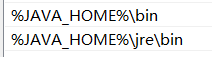

javac java源文件的路径

java 类名

### 运行java步骤

1. cd命令切换到class文件所在目录
2. 执行java Test，java后面只能跟类名

classpath是给类加载器指路的，默认情况下classloader会从当前路径找，配置classpath之后类加载器只会在配置的目录中寻找，不会再从当前的路径中寻找了

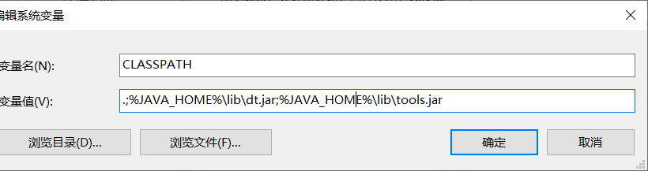

### 标识符

数字、字母、下划线_、美元符号组成不能含有其他符号，不能以数字开头，不能有空格，关键字不能作为标识符

### 命名规范

1. 英语单词
2. 驼峰
3. 类名、接口名首字母大写，后面每个单词首字母大写
4. 变量名首字母小写，后面每个单词首字母大写
5. 所有常量全部大写，单词与单词之间采用下划线衔接
6. Java语言中严格区分大小写

## 第二章 Java基本的程序设计结构

### 数据类型

byte 1字节

short  2

int  4

long  8

float 4

double 8 

boolen  1

char  2 可以存储一个汉字

引用数据类型

#### 1 转义字符

```java
public class Test {
    public static void main(String[] args) {
        //转义字符输出单引号,\'表示一个单引号
        System.out.println('\'');
        //输出\
        System.out.println('\\');
        //输出""
        System.out.println("\"test\"");
        System.out.println("'");
        //\u表示字符的Unicode编码
        char x = '\u4e2d';
        System.out.println(x);
    }
}
```

#### 2 类型转化

1、boolean不能参与类型转换，其它都行。

2、没有超出byte short char的范围,整数可以直接赋值。、

3、自动类型转换小--->大

4、byte < short(char) <int < long < float < double4、强制类型转换大-->小需要加强制类型转换符

5、 byte short char混合运算,先各自转换成int，再做运算

6、多种数据类型混合运算的时候，各自先转换成容量最大的哪一种再做运算。

java中整数默认是int型，long需要在数字后面加L

浮点数默认是double，float后面要加F

精度损失不超过范围可以直接赋值成short byte

```java
/*
    小容量可以直接赋值给大容量，成为自动类型转换
    大容量转换成小容量必须加上强制类型转换符
 */
public class Test {
    public static void main(String[] args) {
        long x = 100L;
        int y = (int)x;
    }
}
```

```java
/*
    整数没有超过范围可以直接赋值给char
 */
public class Test {
    public static void main(String[] args) {
        char c = 97;
        System.out.println(c);  //output:a
    }
}
```

#### 3 混合运算

```java
/*
    byte char short 做混合运算时，先各自转换成int再做运算
 */
public class Test {
    public static void main(String[] args) {
        char c = 'a';
        byte b = 1;
        System.out.println(c+b);  //output:98
        //short s = c + b;  错误，编译器不知道加法结果有没有超过short范围，只知道右边结果是int
        /*int a = 1;错误
        short x = a;*/
    }
}
```

多种数据类型混合运算最终的结果是最大容量对应的类型，除byte char short会变成int

### 运算符

a++ 先执行表达式再自增

++a 先自增再执行表达式

使用扩展运算符不会改变

 

```java
public class Test {
    public static void main(String[] args) {
       byte x = 100;
       x = x+1; //报错
       x += 1;  //正确
    }
}
```

三目运算符

```java
public class Test {
    public static void main(String[] args) {
       int a = 5,b = 6;
       boolean flag = a > b? true:false;
       System.out.println(flag);
    }
}
```


```java
/*
* + 运算符
* 1.求和2.字符串拼接
* 两边都是数字的时候求和
* 任意一方是字符串类型字符串拼接
* */
public class Test {
    public static void main(String[] args) {
      int old = 35;
      System.out.println("年龄=" + 35);
      int a = 100;
      int b = 200;
      //多个加号自左向右依次进行，除非有小括号
      System.out.println(a+b+"110");    //output 300110
    }
}
```

### 用户输入

```java
import java.util.Scanner; // 导入 Scanner 类
public class Main {
 public static void main(String[] args) {
  Scanner myObj = new Scanner(System.in); // 创建 Scanner 对象
  System.out.println("Enter username");
  String userName = myObj.nextLine(); // 读取用户输入
  System.out.println("Username is: " + userName); // 输出用户输入
 }
}
```

| 方法          | 描述                         |
| ------------- | ---------------------------- |
| nextBoolean() | 从用户处读取 boolean 布尔值  |
| nextByte()    | 从用户处读取 byte 字节       |
| nextDouble()  | 从用户处读取 double 双精度值 |
| nextFloat()   | 从用户处读取 float 浮点值    |
| nextInt()     | 从用户处读取一个 int 值      |
| nextLine()    | 从用户处读取 String 字符串值 |
| nextLong()    | 从用户处读取 long 长整形     |
| nextShort()   | 从用户处读取 short 短整形    |

### 控制语句

#### if

```java
import java.util.Scanner;
public class Test {
    public static void main(String[] args) {
        Scanner sc = new Scanner(System.in);
        String out;
        int old = sc.nextInt();
        if(0 <= old && old <= 5) {
            out = "婴幼儿";
        }
        else if (6 <= old && old <= 10 ) {
            out = "少儿";
        }
        else if (11 <= old && old <= 18) {
            out = "少年";
        }
        else if (19 <= old && old <= 35) {
            out = "青年";
        }
        else if (36 <= old && old <= 55) {
            out = "中";
        }
        else if (56 <= old && old <= 150) {
            out = "老年";
        }
        else {
            out = "输入年龄非法";
        }
        System.out.println(out);
    }
}
```

#### switch

switch支持int和Sting类型

```java
import java.util.Scanner;
public class Test {
    public static void main(String[] args) {
        Scanner sc = new Scanner(System.in);
        int old = sc.nextInt();
        switch (old) {
            case 0:
                System.out.println(0);
                break;
            case 1:
                System.out.println(1);
                break;
            default:
                System.out.println("其他");
        }
    }
}
```

#### for

```
import java.util.Scanner;
public class Test {
    //99乘法表
    public static void main(String[] args) {
        for (int i = 1;i <= 9;i++) {
            for (int j = 1;j <= i;j++) {
                System.out.print(j+"*"+i+"="+(i*j)+" ");
            }
            System.out.println();
        }
    }
}
```

#### while

#### do while

```java
import java.util.Scanner;
public class Test {
    //99乘法表
    public static void main(String[] args) {
        int i = 0;
        do {
            i += 1;
            System.out.println(i);
        }while(i <= 10);	//注意分号
    }
}
```

#### break

终结最近循环

#### continue

## 第三章 面向对象

### 1 方法

```java
import java.util.Scanner;
public class Test {
    public static void main(String[] args) {
        sumInt(100,200);
    }
    public static void sumInt(int x,int y) {
        int z = x + y;
        System.out.println(x + " + " + y + " = " + z);
    }
}
```

#### JVM

##### 堆区

  堆是一个运行时数据区，专门用来保存类(class)的实例(instance)并分配空间，不存放基本类型和对象引用，例如new 创建的实例和数组，实际上只是保存实例的属字面量、类型和类型标记等，然而并不保存实例的方法（方法是指令，保存在下一节介绍的栈中）。

  jvm只有一个堆区，它被所有线程共享。堆的大小是由垃圾收集器来负责的，优势是可以动态地分配内存大小，生命周期也不必事先告诉编译器，因为它是在运行时动态分配内存的，垃圾收集器会自动收走不再使用的数据。缺点是由于要在运行时动态分配内存，所以，存取速度较慢。

##### 栈区

  每个线程包含一个栈区，栈中只保存基础数据类型变量的字面量和自定义对象的引用(不是对象)，对象都存放在堆区中。

  每个栈中的数据(基本类型和对象引用)都是私有的，其它栈不能访问。栈分为3个部分：基本类型变量区、执行环境上下文、操作指令区(存放操作指令)。

##### 方法区

  方法区又叫静态区，跟堆一样，被所有的线程共享。它存储的都是在整个程序中永远唯一的元素，如class和static变量。全局变量和静态成员变量的存储是放在一块的，但是，初始化和未初始化的分别存储在相邻的两块区域。

  虚拟机的体系结构包括堆、方法区、本地方法栈和pc寄存器。而方法区保存的就是一个类的模板，堆是放类的实例的，一般来用于函数计算，它里面的数据在函数执行完时是不会存储的，直接丢弃。这就是为什么局部变量每一次都是一样的，即便修改了它后，下次执行函数的时候还是原来的值。

  如果栈内存或者堆内存不足都会抛出异常：

- 栈空间不足：java.lang.StackOverFlowError。
- 堆空间不足：java.lang.OutOfMemoryError。

  栈的空间大小远远小于堆的。栈空间操作起来最快但是空间很小，通常大量的对象都是放在堆空间，理论上整个内存没有被其它进程使用的空间甚至硬盘上的虚拟内存都可以被当成堆空间来使用。

#### 方法重载(overload)

```java
import java.util.Scanner;
public class Test {
    public static void main(String[] args) {
        sum(1,2);
        sum(5l,6l);
        sum(2.1,3.1);
    }
    public static int sum(int x,int y) {
        int z = x + y;
        System.out.println("int sum");
        return z;
    }
    public static long sum(long x,long y) {
        System.out.println("long sum");
        return x+y;
    }
    public static double sum(double x,double y) {
        System.out.println("double sum");
        return x+y;
    }
}
```

什么时候考虑方法重载？两个方法的功能相似

重载条件

1.在同一个类中

2.方法名相同

3.参数类表不同（参数个数，类型，顺序）

方法重载与返回值类型修饰符无关

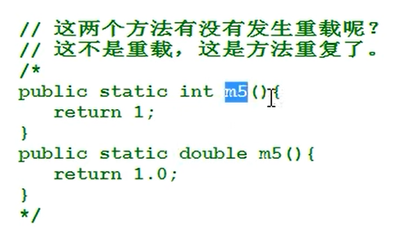

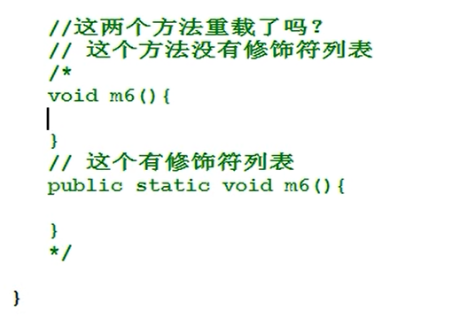

#### 递归

```java
import java.util.Scanner;
public class Test {
    public static void main(String[] args) {
        Scanner obj = new Scanner(System.in);
        int n = obj.nextInt();
        System.out.println(sum(n));
        System.out.println(sum1(n));
    }
    public static int  sum(int n) {
        //for循环计算1-n的和
        int s = 0;
        for (int i = 1;i <= n;i++) {
            s += i;
        }
        return s;
    }
    public static int sum1(int n) {
        //使用递归计算1-n的和
        if(n == 1) {
            return 1;
        }
        return n + sum1(n-1);
    }
}
```

```java
import java.util.Scanner;
public class Test {
    public static void main(String[] args) {
        Scanner obj = new Scanner(System.in);
        int n = obj.nextInt();
        System.out.println(fun(n));
    }
    //求1-n的阶乘   5*4*3*2*1
   public static int fun(int n) {
        if (n == 1) {
            return n;
        }
        return n*fun(n-1);
   }
}
```

### 2 面向对象

#### 类、对象介绍

三大特征：封装，继承，多态

对象（实例）

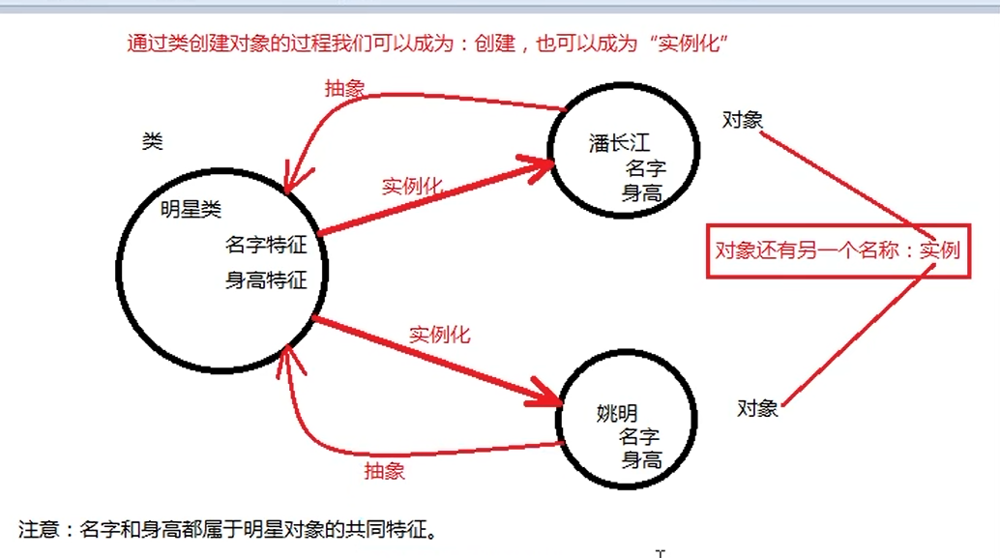

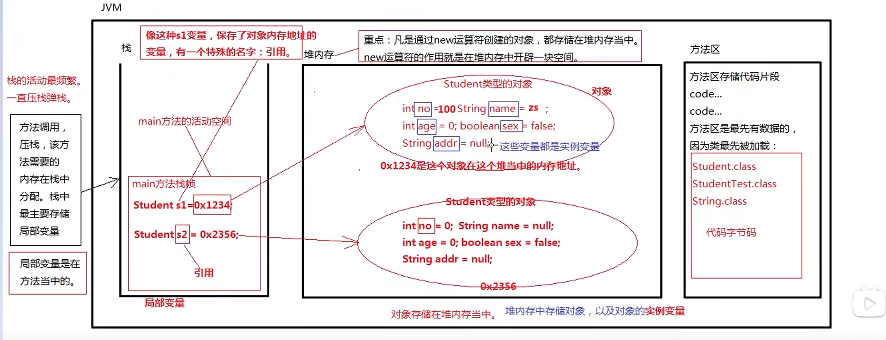

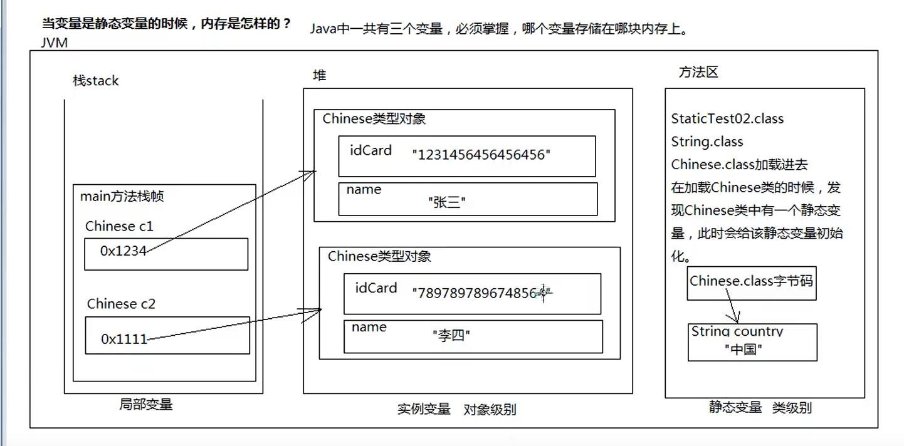

##### 构造方法

1.修饰符统一写public

2.构造方法名和类名必须一致

3.构造方法没有返回值类型

当一个类中没有提供任何构造方法，系统默认提供一个无参数的构造方法。缺省构造器

当一个类中手动提供了构造方法，系统不再提供无参构造方法。

```java
public class Student {
    int number;
    String name;
    int age;
    Student() {}
    Student(int nu,String na,int ag) {
        nu = number;
        na = name;
        ag =  age;
    }
}
import java.util.Scanner;
public class Test {
    public static void main(String[] args) {
        Student s1 = new Student(1,"2",3);
        
    }

}
```

##### static

静态变量，可以通过类名访问

```java
public class Student {
    private int number;
    private String name;
    private int age;
    static String kk = "信了";    //静态变量，类级别的
    Student() {}
    Student(int nu,String na,int ag) {
        nu = number;
        na = name;
        ag =  age;
    }

    public int getNumber() {
        return number;
    }

    public void setNumber(int number) {
        this.number = number;
    }

    public String getName() {
        return name;
    }

    public void setName(String name) {
        this.name = name;
    }

    public int getAge() {
        return age;
    }

    public void setAge(int age) {
        this.age = age;
    }
}
import java.util.Scanner;
public class Test {
    public static void main(String[] args) {
        Student s1 = new Student(1,"2",3);
        System.out.println(Student.kk);
    }

}
```

静态方法

方法中直接访问了实例变量，该方法一定是实例方法

如果是工具类，该工具类当中的方法一定是静态的

静态代码块

```java
import java.util.Scanner;
public class Test {
    //静态代码块在类加载时执行，并且在main方法执行之前执行
    //静态代码块可以自上至下顺序执行
    //作用：类加载时记录类加载时的日志信息，写到静态代码块中。
    //静态代码块和静态变量都在类加载时执行，时间相同，只能靠代码顺序来决定谁先谁后
    
    static {    //一个类中可以有多个静态代码块
        System.out.println("A");
        //System.out.println(a);    错误，非法前向引用
    }
    //static int a = 5;
    static {    //一个类中可以有多个静态代码块
        System.out.println("b");
    }
    public static void main(String[] args) {
        System.out.println("main");

    }
    static {    //一个类中可以有多个静态代码块
        System.out.println("c");
    }
}
```

##### 实例语句块

```
只要构造方法执行，必然在构造方法执行之前，自动执行“实例语句块”中的代码
对象构造时机
```

##### 继承

```java
extends
```

Java只允许单继承，不允许继承多个父类

子类继承父类，除构造方法不能继承之外，剩下的都可以继承，但是私有属性无法在子类中直接访问。

所有类默认继承Object类

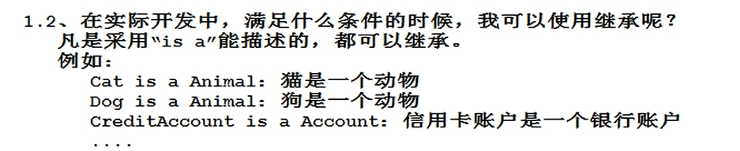

##### toStirng(Object类中方法)

打印类信息（重写父类方法）

```java
public String toString() {
	return getClass().getName()+"@"+Integer.toHexString(hashCode()); 
}
```

```java
import java.util.Scanner;

public class Test {
    public static void main(String[] args) {
        Product p = new Product();
        System.out.println(p.toString());   //out:Product@4554617c
        System.out.println(p);  ////out:Product@4554617c
    }
}

class Product {

}
```

```java
import java.util.Scanner;

public class Test {
    public static void main(String[] args) {
        MyDate m = new MyDate();
        System.out.println(m.toString());
    }
}
class MyDate {
    private int year;
    private int month;
    private int day;
    public MyDate () {
        this(1970,1,1);
    }
    public MyDate(int year, int month, int day) {
        this.year = year;
        this.month = month;
        this.day = day;
    }

    @Override
    public String toString() {
        return "MyDate{" +
                "year=" + year +
                ", month=" + month +
                ", day=" + day +
                '}';
    }

    public int getYear() {
        return year;
    }

    public void setYear(int year) {
        this.year = year;
    }

    public int getMonth() {
        return month;
    }

    public void setMonth(int month) {
        this.month = month;
    }

    public int getDay() {
        return day;
    }

    public void setDay(int day) {
        this.day = day;
    }
}
```

##### 方法覆盖Overrige

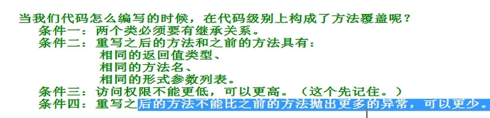

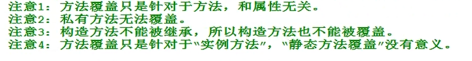

```java
import java.util.Scanner;

public class Test {
    public static void main(String[] args) {
        Cat c = new Cat();
        c.move();
    }
}

class Animal {
    public void move() {
        System.out.println("动物在移动");
    }
}
class Cat extends Animal {
    @Override
    public void move() {
        System.out.println("猫在移动");
    }
}
```

```java
import java.util.Scanner;

public class Test {
    public static void main(String[] args) {
        Chinese c = new Chinese();
        c.setName("张三");
        c.speak();
        American a = new American();
        a.setName("李四");
        a.speak();
    }
}

class  People {
    private String name;
    People() {}
    public People(String name) {
        this.name = name;
    }

    public String getName() {
        return name;
    }

    public void setName(String name) {
        this.name = name;
    }
    public void speak() {
        System.out.println(name + "...");
    }
}
class Chinese extends People {
    @Override
    public void speak() {
        System.out.println(this.getName() + "讲汉语");
    }
}
class American extends People {
    @Override
    public void speak() {
        System.out.println(this.getName() + "讲英语");
    }
}
```

##### 多态

多态指的是父类型引用指向子类型对象

包括编译阶段和运行阶段。

编译阶段：绑定父类的方法

运行阶段：动态绑定子类对象

作用：降低程序耦合度，提高程序扩展力

###### 向上转型和向下转型

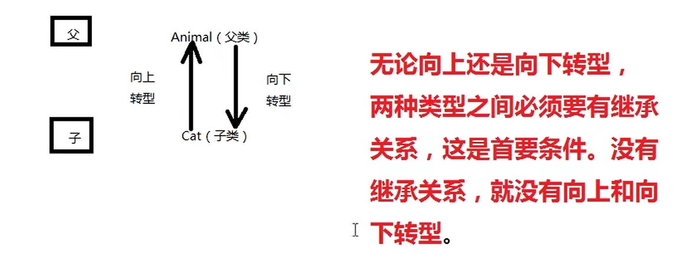

###### 向下转型风险

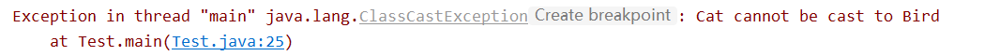

###### 避免：instanceof

任何时候向下转型的时候都要进行instanceof

1.运行阶段动态判断引用指向的对象类型

2.结果只能是:true/false

c是一个引用，c变量保存了内存地址，指向了堆中的对象

假设（c instanceof Cat）为ture表示：

​	c引用指向内存堆中的java对象是一个cat

假设（c instanceof Cat）为false表示：

​	c引用指向内存堆中的java对象不是一个cat

```java
import java.util.Scanner;

public class Test {
    public static void main(String[] args) {
        //普通
        Animal a = new Animal();
        a.move();
        Cat c = new Cat();
        c.move();
        Bird b = new Bird();
        b.move();
        //向上转型 子——》父
        //无论向上转型还是向下转型，两种类型之间必须得有继承关系
        Animal a1 = new Cat();
        a1.move();
        //a1.catFun();  //报错，编译不通过，animal里面没有catFun方法,解决：向下转型
        Animal a2 = new Bird();
        a2.move();
        //向下类型转换 父——》子，当你的方法只有子类中有的时候
        Animal a3 = new Cat();
        Cat x = (Cat)a3;
        x.catFun();
        //java.lang.ClassCastException:类型转换异常
        Animal a4 = new Cat();
        /*Bird y = (Bird)a4;
        y.birdFun();*/
        if (a4 instanceof Bird) {
            Bird y = (Bird)a4;
            y.birdFun();
        }
    }
}

class Animal {
    public void move() {
        System.out.println("动物在移动");
    }
}
class Cat extends Animal {
    @Override
    public void move() {
        System.out.println("猫在移动");
    }
    public void catFun() {
        System.out.println("猫抓老鼠");
    }
}
class Bird extends Animal {
    @Override
    public void move() {
        System.out.println("鸟在移动");
    }
    public void birdFun() {
        System.out.println("鸟吃重紫");
    }
}
```

```java
import java.util.Scanner;

public class Test {
    public static void main(String[] args) {
       Animal x = new Bird();
       Animal y = new Cat();
       if(x instanceof Bird) {
           Bird b = (Bird) x;
           b.birdFun();
       } else if(x instanceof Cat) {
           Cat c = (Cat)x;
           c.catFun();
       }
    }
}

class Animal {
    public void move() {
        System.out.println("动物在移动");
    }
}
class Cat extends Animal {
    @Override
    public void move() {
        System.out.println("猫在移动");
    }
    public void catFun() {
        System.out.println("猫抓老鼠");
    }
}
class Bird extends Animal {
    @Override
    public void move() {
        System.out.println("鸟在移动");
    }
    public void birdFun() {
        System.out.println("鸟吃重紫");
    }
}

```

软件开发七大原则

开闭原则：对扩展开放，对修改减少

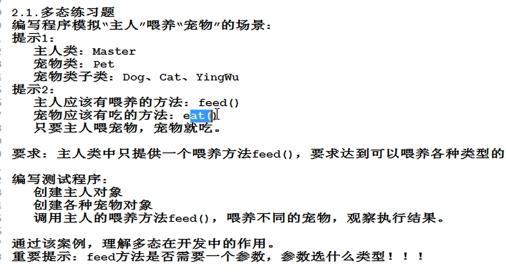

```java
import java.util.Scanner;


public class Test {
    public static void main(String[] args) {
        Master m = new Master();
        Pet p1 = new Dog();
        m.feed(p1);
        Pet p2 = new Cat();
        m.feed(p2);
    }
}

class Master {
    public void feed (Pet p) {
        p.eat();
    }
}
class Pet {
    public void eat() {
        System.out.println("吃");
    }
}
class Dog extends Pet {
    @Override
    public void eat() {
        System.out.println("狗狗吃了");
    }
}
class Cat extends Pet {
    @Override
    public void eat() {
        System.out.println("猫吃了");
    }
}
class Parrot extends Pet {
    @Override
    public void eat() {
        System.out.println("鹦鹉吃了");
    }
}
```

##### super

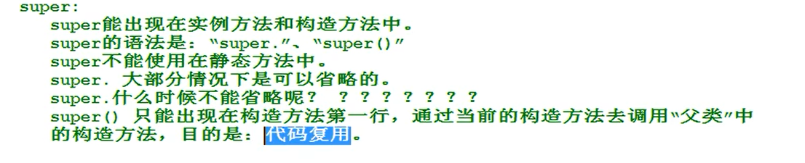

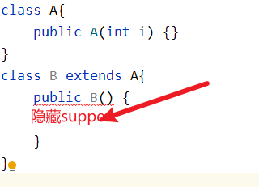

当一个构造方法第一行既没有this()有没有super(),默认会有一个super()

子类构造方法执行时必然会调用父类执行方法

this()和super()不能共存，他们只能在构造函数第一行

```java
import java.util.Scanner;


public class Test {
    public static void main(String[] args) {

    }
}

class A{
    public A(int i) {}
}
class B extends A{
    public B() {
        super(123); //调用父类构造方法
    }
}
```

super内存图

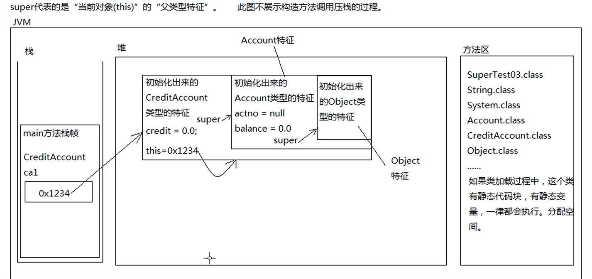

super什么时候不能省略？

子类中有重名属性

super后面必须有.

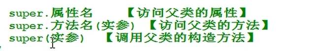

# JavaSE进阶

## 1 IDEA

快捷：

1.sout生成System.out.println

2.删除一行：ctrl+y

3.切换文件：Alt+左箭头或右箭头

## 2 final

1.final修饰的类无法被继承

2.final修饰的方法无法被覆盖，继承

3.final修饰的变量不能重新赋值

final修饰引用

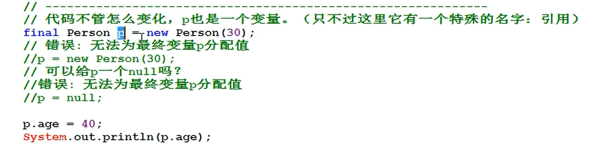

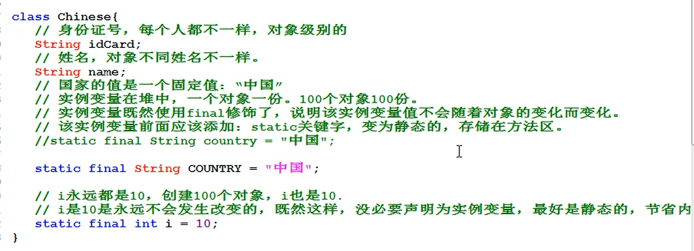

常量：static final联合修饰的变量称为常量

## 3 抽象类

类和类之间共同具有的特征，将这些共同特征提取出来，形成的就是抽象类

抽象类无法创建对象

抽象类也属于引用数据类型

抽象方法：没有实现的方法

抽象类中不一定有抽象方法，抽象方法必须在抽象类中

非抽象类继承抽象类必须将抽象方法实现

```java
import java.util.Scanner;


public class Test {
    public static void main(String[] args) {
        Master m = new Master();
        Pet p1 = new Dog();	//面向抽象编程
        m.feed(p1);
        Pet p2 = new Cat();
        m.feed(p2);
    }
}

class Master {
    public void feed (Pet p) {
        p.eat();
    }
}
abstract class Pet {
    public abstract void eat();
}
class Dog extends Pet {
    @Override
    public void eat() {
        System.out.println("狗狗吃了");
    }
}
class Cat extends Pet {
    @Override
    public void eat() {
        System.out.println("猫吃了");
    }
}
class Parrot extends Pet {
    @Override
    public void eat() {
        System.out.println("鹦鹉吃了");
    }
}
```

## 4 接口（interface）

接口支持多继承

接口中只包含常量和抽象方法

接口中所有元素都是public修饰的，抽象方法定义时public abstract可以省略

接口中的常量public static final可以省略

实现：implements

非抽象类继承接口时必须将接口中的方法全部重写

```java
import java.util.Scanner;


public class Test {
    public static void main(String[] args) {
        Master m = new Master();
        Pet p1 = new Dog();
        m.feed(p1);
        Pet p2 = new Cat();
        m.feed(p2);
    }
}

class Master {
    public void feed (Pet p) {
        p.eat();
    }
}
interface  Pet {
    void eat();
}
class Dog implements Pet {
    @Override
    public void eat() {
        System.out.println("狗狗吃了");
    }
}
class Cat implements Pet {
    @Override
    public void eat() {
        System.out.println("猫吃了");
    }
}
class Parrot implements Pet {
    @Override
    public void eat() {
        System.out.println("鹦鹉吃了");
    }
}
```

继承接口都存在时：extends在前，implements在后

```java
class Dog extends Animal implements Pet {
    @Override
    public void eat() {
        System.out.println("狗狗吃了");
    }
}
```

类之间关系

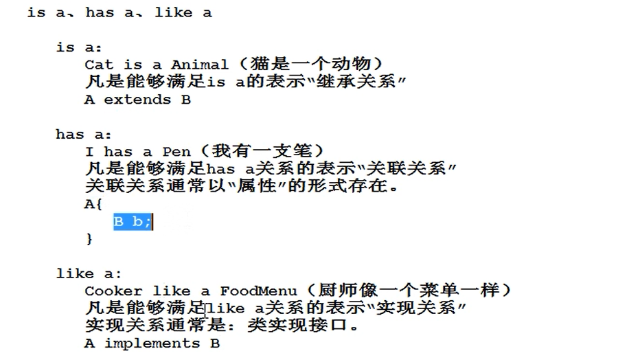

## 5 包

### package是一个关键字，后面加包名，只允许出现在java源代码第一行

包名命名规范：公司域名倒叙+项目名+模块名+功能名

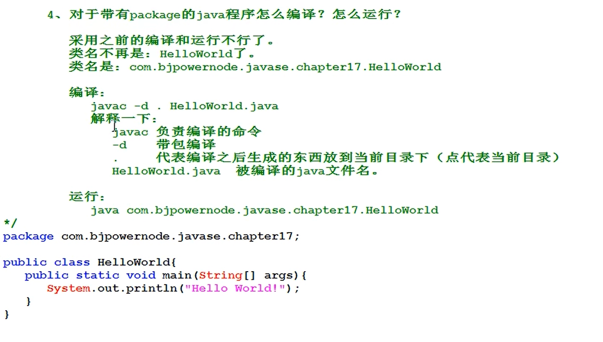

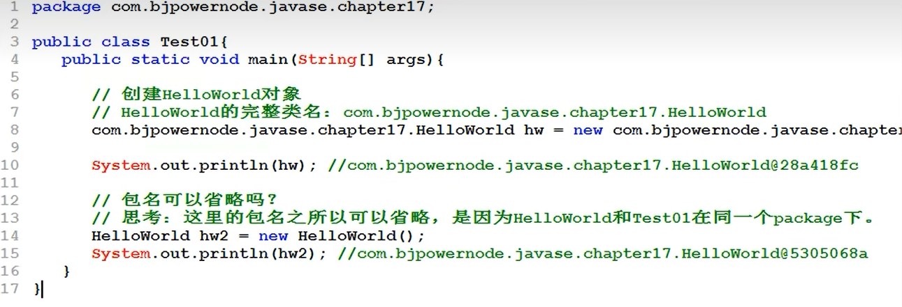

不在同一个包下包名不能省略

### import

什么时候用？

A类B类都在同一个包下，不需要import

A类B类不在同一个包下，需要import

怎么用？

只能出现在package语句之下，class声明语句之上

采用*方式

lang包不需要手动导入

```java
import java.util.Scanner;
import java.util.*;
```

## 6 访问权限

| 访问控制修饰符 | 本类 | 同包 | 子类 | 任意位置 |
| :------------: | :--: | :--: | :--: | -------- |
| private        | √ | × | × | × |
| 默认           | √ | √ | × | × |
| protected      | √ | √ | √ | × |
| public         | √ | √ | √ | √ |

## 7 Object

### toString

### equals

```java
public boolean equals(Object obj) {
    return (this == obj);
}
```

判断基本数据相等 ==

判断两个java对象是否相等 双等号只会判断变量保存的内存地址是否相等，使用重写的equals

比较字符串必须调用equals方法，String类已经重写了equals方法

String类重写了toString方法

java中所有引用数据类型统一使用eauals方法判断是否相等

```java
@Override
    public boolean equals(Object o) {
        if (this == o) return true;
        if (o == null || getClass() != o.getClass()) return false;
        MyDate myDate = (MyDate) o;
        return year == myDate.year && month == myDate.month && day == myDate.day;
    }
```

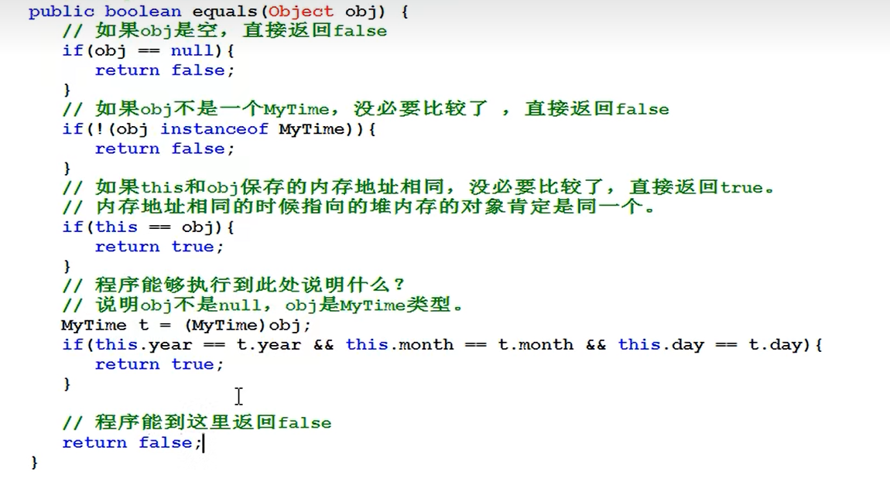

### finalize

```java
protected void finalize()  throws  Throwable {}
```

finalize()方法只有一个方法体，里面没有代码，而且这个方法是protected修饰的

垃圾销毁时机，只需要重写，程序会被自动调用

### hashCode()方法

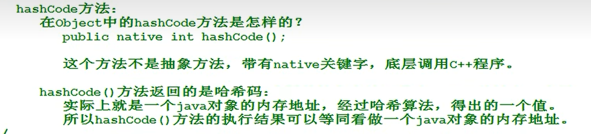

## 8 匿名内部类

```java
import java.util.Objects;
import java.util.Scanner;

public class Test {
    public static void main(String[] args) {
        //普通实现
        MyMath m = new MyMath();
        m.mySum(new Compute11(),1,2);
        //使用匿名内部类
        m.mySum(new Compute() {
            @Override
            public int sum(int a, int b) {
                return a+b;
            }
        },1,1);
    }
}
interface Compute {
    int sum(int a,int b);
}
class Compute11 implements Compute{
    @Override
    public int sum(int a, int b) {
        return a+b;
    }
}
class MyMath {
    public void mySum(Compute c,int x,int y) {
        int retValue = c.sum(x,y);
        System.out.println(x + "+" + y + "=" + retValue);
    }
}
```

## 9 数组

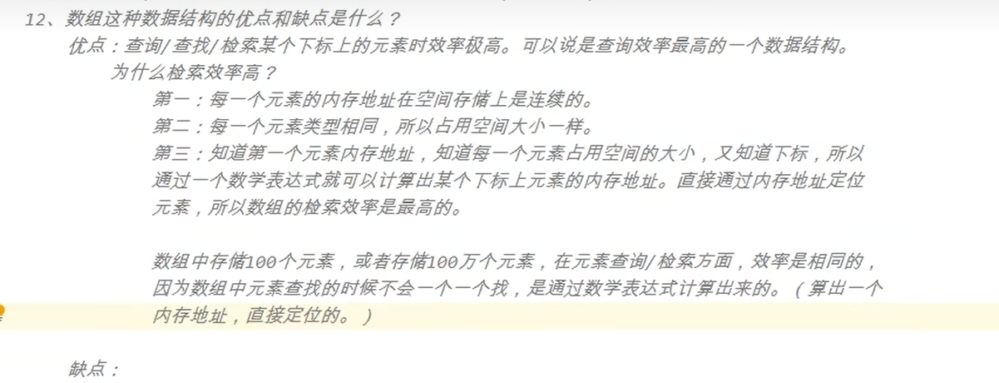

​	缺点：增删难，空间有限

### 声明和初始化

#### 声明：

int[] array;

double[] array;

### 初始化

静态初始化：int[] array = {100,200,300};

动态初始化:  int[] arry = new int[5];

数组扩容

```java
package com.javase.arry;
//数组扩容
public class ArrayTest04 {
    public static void main(String[] args) {
        int[] src = {1,2,3,4,5};
        int[] dest = new int[20];
        //源数组，源起始位置，目标数组，目标起始位置，长度
        System.arraycopy(src,0,dest,0,5);
    }
}
```

### 二维数组

```java
package com.javase.arry;

public class ArrayTest05 {
    public static void main(String[] args) {
        int [][] a = {{1,2,3},{4,5,6},{7,8,9}};
        System.out.println(a.length);
        for (int i = 0; i < a.length; i++) {
            for (int j = 0; j < a[i].length; j++) {
                System.out.print(a[i][j]);
            }
            System.out.println();
        }
    }
}
```

数组模拟栈

```java
package com.javase.arry;
//数组模拟栈数据结构
public class ArrayStack {
    public static void main(String[] args) {
        MyStack ms = new MyStack();
        ms.push(2);
        ms.push(3);
        ms.push(6);
        ms.push(7);
        ms.print();
        ms.pop();
        ms.print();
    }
}
class MyStack {
    private Object[] elements;  //存储栈内任何引用型数据类型
    private int index = 0;
    public MyStack() {
        elements = new Object[10];
    }
    public MyStack(Object[] elements) {
        this.elements = elements;
    }

    public void push(Object o) {    //压栈操作
        if (index >= 50) {
            System.out.println("非法，栈满了！！");
            return;
        }
        else {
            elements[index] = o;
            System.out.println("元素"+elements[index]+"被压入栈了");
            ++index;
        }
    }
    public Object pop() {   //弹栈操作
        if (elements.length == 0) {
            System.out.println("空栈，非法！！！");
            return null;
        }
        else {
            --index;
            System.out.println("元素"+elements[index]+"被弹出栈了");
            return elements[index];
        }
    }
    public void print() {   //打印栈元素
        if (elements.length == 0) {
            System.out.println("空栈！");
            return ;
        }
        else {
            System.out.println("由栈顶到栈底输出元素：");
            for (int i = index-1; i >= 0; i--) {
                System.out.print(elements[i]+" ");
                System.out.println();
            }
        }
    }

    public Object[] getElements() {
        return elements;
    }

    public void setElements(Object[] elements) {
        this.elements = elements;
    }

    public int getIndex() {
        return index;
    }

    public void setIndex(int index) {
        this.index = index;
    }
}
```

冒泡排序

```java
package com.javase.arry;
//冒泡排序
public class BubbleSort {
    public static void main(String[] args) {
        int[] arr = {3,4,8,11,1,2};
        for (int i = arr.length; i > 0 ; i--) {
            for (int j = 0; j < arr.length-1; j++) {
                if (arr[j] > arr[j+1]) {
                    int temp;
                    temp = arr[j];
                    arr[j] = arr[j+1];
                    arr[j+1] = temp;
                }
            }
        }
        for (int i = 0; i < arr.length; i++) {
            System.out.println(arr[i]);
        }
    }
}
```

```java
package com.javase.arry;
//选择排序
public class SelectSort {
    public static void main(String[] args) {
        int[] arr = {3,4,8,11,1,2};
        for (int i = 0; i < arr.length-1; i++) {
            int min = arr[i];
            int flag = i;
            for (int j = i+1; j < arr.length; j++) {
                if(min > arr[j]) {
                    min = arr[j];
                    flag = j;
                }
            }
            if(flag != i) {
                int temp = arr[i];
                arr[i] = arr[flag];
                arr[flag] = temp;
            }
        }
        for (int i = 0; i < arr.length; i++) {
            System.out.println(arr[i]);
        }
    }
}
```

二分查找

```java
package com.javase.arry;
import java.util.Arrays;
//二分查找
public class BiSearch {
    public static void main(String[] args) {
        int[] arr = {3,4,8,11,1,2};
        Arrays.sort(arr);
        int index = biSearch(arr,8);
        System.out.println(index);
    }
    public static int biSearch(int []arr,int number) {
        int begin = 0;
        int end = arr.length - 1;
        while (begin <= end) {
            int mid = (begin + end) / 2;
            if (arr[mid] == number) {
                return mid;
            } else if (arr[mid] > number) {
                end = mid - 1;
            } else if (arr[mid] < number) {
                begin = mid + 1;
            }
        }

        return -1;
    }
}
```

### 使用arrays类

封装的排序，二分查找

## 10 常用类

### String

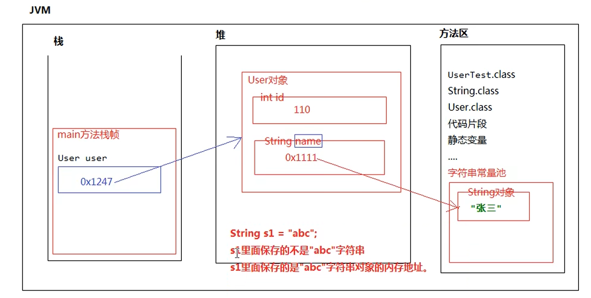

```java
package com.javase.stringtest;

public class StringTest01 {
    public static void main(String[] args) {
        String s1 = "abc";
        String s2 = "abc";
        System.out.println(s1 == s2);   //true
        String x = new String("abc");
        String y = new String("abc");
        System.out.println(x == y); //false
        System.out.println(x.equals(y));    //true,String类已经重写了equals类
    }
}

```

面试题

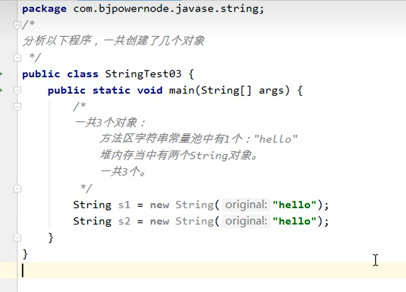

#### 常用构造方法

```java
package com.javase.stringtest;

public class StringTest02 {
    public static void main(String[] args) {
        byte[] b = {97,98,99};
        String s = new String(b);
        System.out.println(s);
        //将数组中一部分转换成字符串,起始位置，长度
        String s3 = new String(b,1,2);
        System.out.println(s3);
    }
}
```

String方法

帮助文档

```java
package com.javase.stringtest;

public class StringTest03 {
    public static void main(String[] args) {
        //charAt
        char c = "中国人".charAt(1);
        System.out.println(c);
        //compareTo,前小后大-1，前大后小1，相等0
        int result = "abc".compareTo("abc");
        System.out.println(result);
        //contains判断前面字符串是否包含后面的字符串
        System.out.println("123".contains("12"));
        //split 拆分字符串
        String[] ymd = "1980-10-11".split("-");
        for (int i = 0; i < ymd.length; i++) {
            System.out.println(ymd[i]);
        }
        //sunString截取字符串
        //toCharArray将字符串转换成char数组
        char[] cha = "我是中国人".toCharArray();
        for (int i = 0; i < cha.length; i++) {
            System.out.println(cha[i]);
        }
    }
}
```

### StringBuffer

使用大量字符串拼接使用该方法

```
stringBuffer 是线程安全的
stringBuilder是线程不安全的
```

### 8种包装类

| 基本数据类型 | 包装类型          |
| ------------ | ----------------- |
| byte         | java.lang.Byte    |
| short        | java.lang.Short   |
| int          | java.lang.Integer |
| long         | java.lang.Long    |
| float        | java.lang.Float   |
| double       | java.lang.Double  |
| boolen       | java.lang.Boolen  |
| char         | java.lang.Char    |

#### 拆箱装箱

```java
package com.javase.integer;

public class IntegerTest01 {
    public static void main(String[] args) {
        //基本数据类型 -(转换为)-》引用数据类型（装箱）
        Integer i = new Integer(123);
        //引用类型->基本数据类型（拆箱）
        int r = i.intValue();
        System.out.println(r);
        Integer x = 100;//自动装箱
        int y = x;//自动拆箱
        //java将-128~127之间包装对象放到整数型常量池了
        Integer a = 128;
        Integer b = 128;
        System.out.println(a == b); //false
        Integer aa = 127;
        Integer bb = 127;
        System.out.println(aa == bb);   //true
    }
}

```


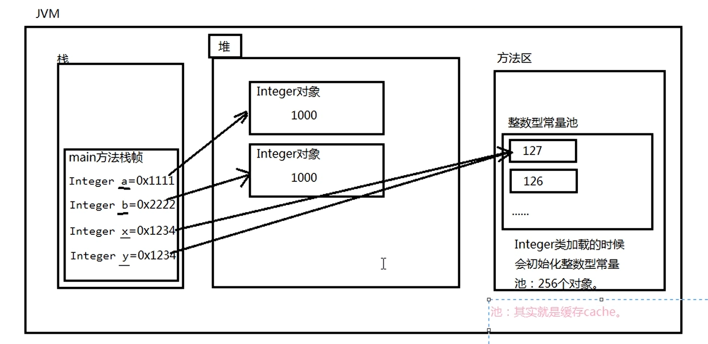

#### 常用方法：

```java
int ret = Integer.parseInt("123");//String转换为int
double ret2 = Double.parseDouble("3.14");	//String转换为int
String bin = Integer.toBinaryString(3);	//十进制转换成2进制
String hex = Integer.toHexString(19);//十进制转换成16进制
```

#### String int Integer转换

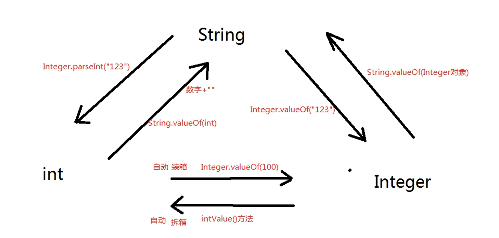

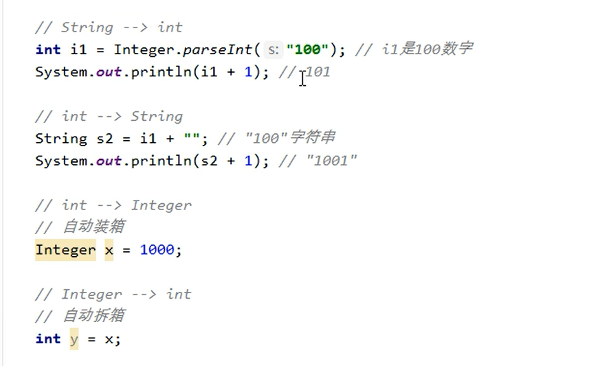

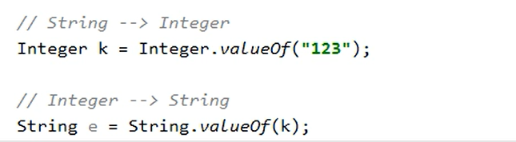

### java对日期处理

java.util.Date

```java
package com.javase.date;
import java.text.ParseException;
import java.text.SimpleDateFormat;
import java.util.Date;
public class DateTest01 {
    public static void main(String[] args) throws ParseException {
        //获取系统当前时间
        Date nowTime = new Date();
        System.out.println(nowTime);    //重写了toString方法
        //日期格式化
        /*
            yyyy 年
            MM月
            dd日
            HH时
            mm分
            ss 秒
            SSS毫秒
         */
        SimpleDateFormat sdf = new SimpleDateFormat("yyyy-MM-dd HH:mm:ss SSS");
        String nowT = sdf.format(nowTime);
        SimpleDateFormat sdf2 = new SimpleDateFormat("HH:mm:ss SSS");
        String nowT2 = sdf2.format(nowTime);
        System.out.println(nowT);
        System.out.println(nowT2);
        //现在有一个日期字符串string，转换成date类型
        String time = "2023-04-16 10:47:39 346";
        //格式要与字符串一样
        SimpleDateFormat sdf3 = new SimpleDateFormat("yyyy-MM-dd HH:mm:ss SSS");
        Date dateTime = sdf3.parse(time);   //注意抛出异常
        System.out.println(dateTime);
    }
}
```

```java
package com.javase.date;

public class DateTest02 {
    public static void main(String[] args) {
        long nowTimeMillis =  System.currentTimeMillis();   //获取1970.1.1 00:00:00 000到当前系统时间的总毫秒数
        System.out.println(nowTimeMillis);
        //统计一个方法执行所耗费的时长
        long begin = System.currentTimeMillis();
        print();
        long end = System.currentTimeMillis();
        System.out.println("耗费时长"+(end - begin)+"毫秒");
    }
    public static void print() {
        for (int i = 0; i < 1000; i++) {
            System.out.println("i = " + i);
        }
    }
}
```

```java
package com.javase.date;

import java.text.SimpleDateFormat;
import java.util.Date;

public class DateTest03 {
    public static void main(String[] args) {
        //转入1970.1.1 00:00:00 000到现在毫秒数
        Date time = new Date(1);
        SimpleDateFormat sdf = new SimpleDateFormat("yyyy-MM-dd HH:mm:ss SSS");
        String sTime = sdf.format(time);
        System.out.println(sTime);
        //获取昨天的此时时间
        Date time2 = new Date(System.currentTimeMillis() - 1000*60*60*24);
        String sTime2 = sdf.format(time2);
        System.out.println(sTime2);
    }
}
```

### 数字格式化

```java
package com.javase.number;

import java.math.BigDecimal;
import java.text.DecimalFormat;

public class DecimalFormatTest01 {
    public static void main(String[] args) {
        DecimalFormat df = new DecimalFormat("###,###.00"); //保留两个小数位
        String s = df.format(123456.1);
        System.out.println(s);
        DecimalFormat df1 = new DecimalFormat("###,###.##");
        String s1 = df.format(123456.1);
        System.out.println(s1);
        /*
        BigDecimal处理大数据，财务用的
         */
        BigDecimal v1 = new BigDecimal(100);
        BigDecimal v2 = new BigDecimal(200);
        BigDecimal v3 = v1.add(v2);
        System.out.println(v3);
        
    }
}
```

### Random

```
package com.javase.random;

import java.util.Random;

public class RandomTest01 {
    public static void main(String[] args) {
        //产生一个int型类型范围内的随机数
        Random random = new Random();
        int a = random.nextInt();
        System.out.println(a);

        //[0~100]随机数
        int b = random.nextInt(101);
        System.out.println(b);

    }
}
```

### 枚举

```java
package com.javase.enumTest;
//枚举编译之后也是生成class
/*
结果只有两种，使用bool
结果有多种，可以一枚一枚列举出来，建议使用枚举
 */
public class EnumTest {
    public static void main(String[] args) {
        Result r = divide(10,0);
        System.out.println(r == Result.SUSSES? "计算成功" : "计算失败");
    }
    public static Result divide(int a,int b) {
        try {
            int c = a / b;
            return Result.SUSSES;
        } catch(Exception e) {
            return Result.FAIL;
        }
    }
}
enum Result {
    SUSSES,FAIL
}
```

### 异常

所有异常都是在运行时发生的


#### 异常处理

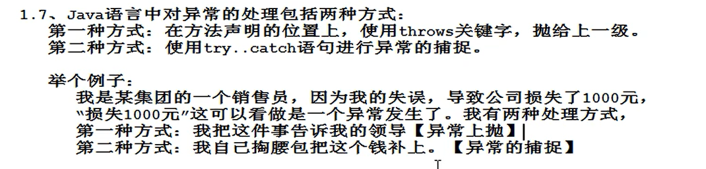

```java
package com.javase.exception;
//异常在java中以类存在

public class ExceptionTest01 {
    public static void main(String[] args) {
        //因为 doSome 有throws ClassNotFoundException,调用时必须预先处理这个异常,否则不能调用
        try {
            doSome();
        } catch (ClassNotFoundException e) {
            e.printStackTrace();
        }
    }
    /*
    doSome表示方法在执行过程中，有可能会出现ClassNotFoundException异常
     */
    public static void doSome() throws ClassNotFoundException{

    }

}
```

```java
package com.javase.exception;

import java.io.FileInputStream;
import java.io.FileNotFoundException;
import java.io.IOException;

public class ExceptionTest02 {
    public static void main(String[] args) {
        m1();
    }
    public static void m1() {
        System.out.println("m1 begin");
        try {
            m2();
            System.out.println("执行不了");
        } catch (IOException e) {   //e是new出来的异常对象提供的方法
            e.printStackTrace();
            System.out.println("文件不存在了哦！！！");
        }
        System.out.println("m1 end");   //继续执行
    }
    public static void m2() throws IOException {        //抛FileNotFoundException父类IOException 或Exception都可以
        System.out.println("m2 begin");
        m3();
        System.out.println("m2 end");   //不执行
    }
    public static void m3() throws FileNotFoundException {
        System.out.println("m3 begin");
        new FileInputStream("C:\\Users\\William\\Desktop\\kkk\\git\\REAE.md");    //构造方法有抛出异常
        System.out.println("m3 end");   //不执行
    }
}
```

```
m1 begin
m2 begin
m3 begin
文件不存在了哦！！！
m1 end
```

#### 处理方式的选择

如果希望调用者处理，throws，负责try

#### 常用方法

```java
e.getMessage();
e.printStackTrace();
```

#### finally

1.finally子句中的代码是最后执行的，并且一定会执行，有return都会执行，即使try语句块中的代码出现了异常

finally字句必须和try一起出现，不能单独编写

try和finally可以一起出现，不要catch，try不能单独出现

try中即使有return，finally都可以执行

退出jvm与局部在执行

System.exit(0);

2.finally语句使用情形:完成对资源的释放

```java
package com.javase.exception;

import java.io.FileInputStream;
import java.io.FileNotFoundException;
import java.io.IOException;

public class ExceptionTest05 {
    public static void main(String[] args) {
        FileInputStream fileInputStream = null;
        try {
            fileInputStream = new FileInputStream("");
            String s = null;
            s.toString();
            fileInputStream.close();    //输入流需要关闭，没有finally关闭不了,放在这里可能关闭不了
        } catch (FileNotFoundException e) {
            e.printStackTrace();
        } catch (IOException e) {
            e.printStackTrace();
        } finally {
            //此处代码一定会执行
            if (fileInputStream != null) {
                try {
                    fileInputStream.close();
                } catch (IOException e) {
                    e.printStackTrace();
                }
            }
        }
    }
}
```

#### 面试题

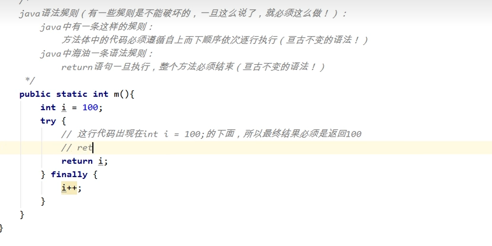

#### final finally finalize区别

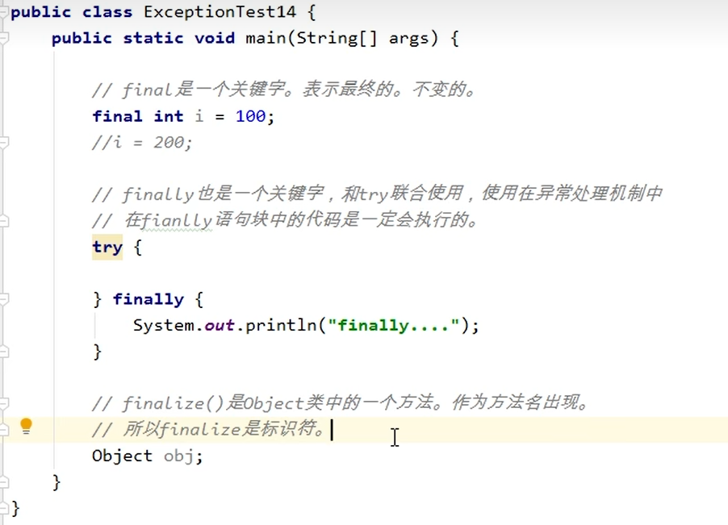

#### 自定义异常

```java
package com.javase.exception;

public class ExceptionTest04 {
    public static void main(String[] args) {
        MyException e = new MyException("hhh");
        e.printStackTrace();
        String me = e.getMessage();
        System.out.println(me);
    }
}
/*
    自定义异常类：
    第一步：编写一个类继承Exception或者RuntimeException
    第二步：提供两个构造方法，一个无参的，一个带有String参数的
 */
class MyException extends Exception{
    public MyException() {

    }
    public MyException(String s) {
        super(s);
    }
}
```

## 11 集合

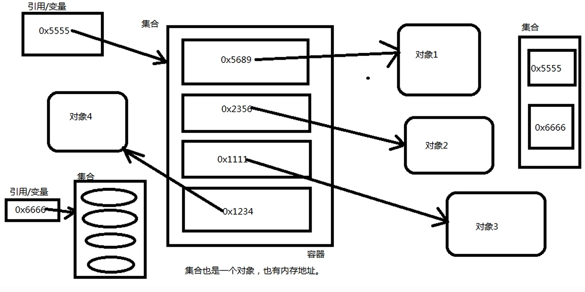

java.util.*;

在java中集合分为两大类：

1.单个方式存储元素，超级父接口:java.util.Collection

2.键值对存储元素，java.util.Map


List特点：此处顺序并不是大小顺序，而是存入数据的先后顺序。有序因为List集合都有下标，下标从0开始，以递增。

Set特点：取出顺序不一定为存入顺序，另外Set集合没有下标。

ArrayList是非线程安全的。

HashSet集合在new的时候，底层实际上new了一个HashMap集合。向HashSet集合中存储元素，实际上是存储到了HashMap的key中了。HashMap集合是一个Hash表数据结构。

SortedSet集合存储元素的特点：由于继承了Set集合，所以他的特点也是无序不可重复，但是放在SortedSet集合中的元素可以自动排序。放到该集合中的元素是自动按照大小顺序排序的。

TreeSet集合底层实际上是TreeMap。TreeSet集合在new的时候，底层实际上new了一个TreeMap集合。向TreeSet集合中存储元素，实际上是存储到了TreeMap的key中了。TreeMap集合是一个二叉树数据结构。


### collection


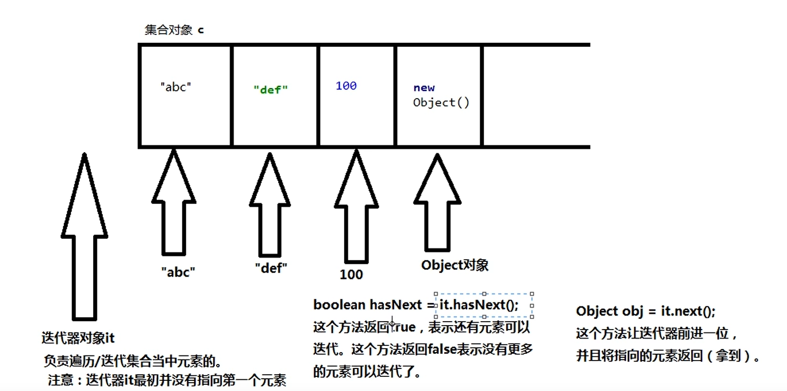

```java
package com.iteator.collection;
//Collection没有泛型之前智能存储object
//collection常用方法
import java.util.*;

public class CollectionTest01 {
    public static void main(String[] args) {
        Collection c = new ArrayList(); //duotai,接口不能直接new对象
        //常用方法add
        c.add(1200);    //自动装箱
        c.add(3.14);
        c.add(new Object());
        c.add(true);

        System.out.println("集合中的元素个数" + c.size());
        c.clear();
        c.add(1200);    //自动装箱
        c.add(3.14);
        //c里面是否包含某个元素
        System.out.println(c.contains("1200"));
        c.remove(3.14);
        System.out.println(c.isEmpty());
        //转换成数组
        Object[] objs = c.toArray();
        for (int i = 0; i < objs.length; i++) {
            System.out.println(objs[i]);
        }
        /*
        迭代，在map集合中不能用，只有在Collection集合中才能使用
         */
        c.clear();
        c.add("a");
        c.add("b");
        c.add("c");
        //第一步，获取迭代器
        Iterator it = c.iterator();
        /*
        迭代器方法：
        boolean hasNext() 如果迭代具有更多元素，则返回 true 。
        E next() 返回迭代中的下一个元素。
         */
        while (it.hasNext()) {
            System.out.print(it.next()+" ");
        }
    }
}
```

contains、remove分析(都调用了equals方法)

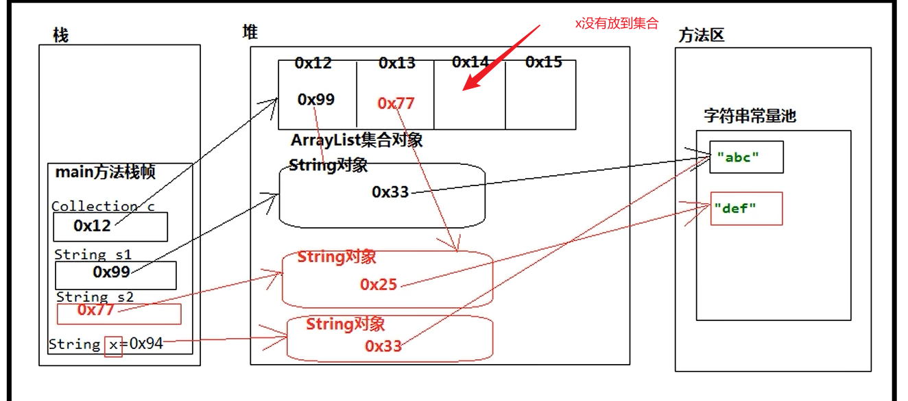

```java
package com.iteator.collection;

import java.util.ArrayList;
import java.util.Collection;

public class CollectionTest02 {
    public static void main(String[] args) {
        Collection c = new ArrayList();

        String s1 = new String("abd");
        String s2 = new String("def");
        c.add(s1);
        c.add(s2);
        String x = new String("abd");
        System.out.println(c.contains(x));  //true
        c.remove(x);
        System.out.println(c.size());   //1,删掉了s1
    }
}
```

集合结构发生改变，迭代器一定要更新

```java
package com.iteator.collection;

import java.util.ArrayList;
import java.util.Collection;
import java.util.Iterator;

public class CollectionTest03 {
    public static void main(String[] args) {
        Collection c = new ArrayList();
        c.add("a");
        c.add("b");
        c.add("c");
        Iterator it = c.iterator();
        while (it.hasNext()) {
            //c.remove(it.next()); 错误，集合结构改变迭代器必须更新

            System.out.println(it.next());
            it.remove();    //通过迭代器删除可以，自动更新迭代器和集合
        }
        System.out.println(c.size());   //0
    }
}
```

#### Collections工具类

```java
package com.iteator.collection;

import java.util.*;

public class CollectionTest04 {
    public static void main(String[] args) {
        List<String> list = new ArrayList<>();  //ArrayList线程不安全
        //变成线程安全的
        Collections.synchronizedList(list);
        //排序,自定义类要实现comparable
        list.add("b");
        list.add("c");
        list.add("a");
        Collections.sort(list);
        for (String s : list) {
            System.out.println(s);
        }
        // 对set集合排序，将set转换成list
        Set<String> set = new HashSet<>();
        List<String> myList = new ArrayList<>(set);

    }
}
```

### List

1.有序可重复

2.特有方法：

- - |  返回  |                             描述                             |
    | :----: | :----------------------------------------------------------: |
    |  `E`   |        `get(int index)`  返回此列表中指定位置的元素。        |
    | `void` | `add(int index, E element)`  将指定的元素插入此列表中的指定位置（可选操作）。 |
    | `int`  | `indexOf(Object o)`  返回此列表中指定元素的第一次出现的索引，如果此列表不包含元素，则返回-1。 |
    | `int`  | `lastIndexOf(Object o)`  返回此列表中指定元素的最后一次出现的索引，如果此列表不包含元素，则返回-1。 |
    |  `E`   | `remove(int index)`  删除该列表中指定位置的元素（可选操作）。 |
    |  `E`   | `set(int index, E element)`  用指定的元素（可选操作）替换此列表中指定位置的元素。 |

```java
package com.iteator.collection;

import java.util.ArrayList;
import java.util.Iterator;
import java.util.List;

/*
1.List
 */
public class ListTest01 {
    public static void main(String[] args) {
        List list = new ArrayList<>();
        list.add("a");
        list.add("b");
        list.add("c");
        list.add("d");
        list.add(1,"4654654");
        Iterator it = list.iterator();
        while (it.hasNext()) {
            System.out.println(it.next());
        }
        System.out.println(list.get(2));
        for (int i = 0; i < list.size(); i++) {
            System.out.println(list.get(i));
        }
        System.out.println(list.indexOf("d"));
        System.out.println(list.lastIndexOf("c"));
        list.set(2,"22222");
    }
}
```

#### ArrayList

1.底层采用数组实现，非线程安全的

2.初始化容量是10，扩容1.5倍，尽量给一个预定的初始化

3.优缺点：检索效率高，随机增删元素效率比较低，向数组末尾增加元素，效率较高

4.面试arraylist集合

#### LinkedList

1.底层采用双向链表结构，地址不连续，增删方便，查找不方便

#### Vector

1.底层数组

2.初始化容量10，扩容2倍

### 泛型机制

泛型使集合中存储类型统一

```java
package com.iteator.genericTest01;

import java.util.ArrayList;
import java.util.Iterator;
import java.util.List;

public class Generic01 {
    public static void main(String[] args) {
        List list =new ArrayList();
        Cat c = new Cat();
        Bird bird = new Bird();
        list.add(c);
        list.add(bird);
        Iterator it = list.iterator();
        while (it.hasNext()) {
            //没有泛型需要向下转型，通过迭代器取出的是object
            Object obj = it.next();
            if(obj instanceof Animal) {
                Animal a = (Animal)obj;
                a.move();
            }
        }
        //使用泛型之后集合中的存储类型统一，只能存储Animal类型
        List<Animal> list1 = new ArrayList<Animal>();
        list1.add(c);;
        list1.add(bird);
        Iterator<Animal> it1 = list1.listIterator();
        while(it1.hasNext()) {
            //不需要强制类型转换，it是animal类型
            it1.next().move();
        }
    }
}
class Animal {
    public void move() {
        System.out.println("动物在移动");
    }
}
class Cat extends Animal {
    @Override
    public void move() {
        System.out.println("猫在移动");
    }
}
class Bird extends Animal {
    @Override
    public void move() {
        System.out.println("鸟在移动");
    }
    public void birdFun() {
        System.out.println("鸟吃重紫");
    }
}
```

#### 类型自动推断

```java
List<Animal> list1 = new ArrayList<>();
```

#### 自定义泛型

```java
package com.iteator.genericTest01;

public class Generic02<泛型标识符随便写> {
    public void doSome(int o) {

    }
    public void fun(泛型标识符随便写 p) {
        System.out.println(p);
    }

    public static void main(String[] args) {
        Generic02<String> gt = new Generic02<>();   //不用泛型就是object
        gt.fun("12");
    }
}
```

### forEach

```java
package com.iteator.foreach;

import java.util.ArrayList;
import java.util.Iterator;
import java.util.List;

public class ForEachTest01 {
    public static void main(String[] args) {
        int[] arr = {1,2,3,4,5,6};
        //putong遍历
        for (int i = 0; i < arr.length; i++) {
            System.out.print(arr[i]);
        }
        System.out.println();
        //增强foreach，data是数组中的元素
        for (int data : arr) {
            System.out.print(data);
        }
        System.out.println();
        List<Integer> list = new ArrayList<>();
        list.add(1);
        list.add(2);
        list.add(3);
        Iterator<Integer> it = list.iterator();
        for (Integer i: list) {
            System.out.print(i);
        }
    }
}
```

### HashSet

无序不可重复

### TreeSet

无序不可重复，但存储元素可以自动按照大小排序

### Map

1.map和collection没有继承关系

2.map集合以key和value键值对方是存储

常用方法

```java
package com.iteator.map;

import java.util.*;

public class MapTest01 {
    public static void main(String[] args) {
        Map<Integer,String> map = new HashMap<>();
        map.put(1,"张三");
        map.put(2,"李四");
        map.put(3,"王五");
        System.out.println(map.get(2));
        System.out.println(map.size());
        //equals实现
        System.out.println(map.containsKey(1));
        System.out.println(map.containsValue("张三"));
        //获取所有valus
        Collection<String> values = map.values();
        for(String s : values) {
            System.out.print(s);
        }
        System.out.println();
        /*map遍历*/
        map.put(4,"1213");
        //1.获取所有的key，遍历key，来遍历value
        Set<Integer> keys = map.keySet();
        Iterator<Integer> it = keys.iterator();
        while (it.hasNext()) {
            Integer key = it.next();
            String value = map.get(key);
            System.out.println(key + "=" + value);
        }
        for (Integer key : keys) {
            System.out.println(key + "=" +map.get(key));
        }
        //2.Set<Map.Entry<K,V>> entrySet(),建议使用这种方式，效率高
        Set<Map.Entry<Integer,String>> set = map.entrySet();
        Iterator<Map.Entry<Integer,String>> it1 = set.iterator();
        while (it1.hasNext()) {
            Map.Entry<Integer,String> node = it1.next();
            Integer key = node.getKey();
            String value = node.getValue();
            System.out.println(key + "=" + value);
        }

        for (Map.Entry<Integer,String> node : set) {
            System.out.println(node.getKey() + "-->" + node.getValue());
        }
    }
}
```

### 哈希表

HashMap

1.底层是哈希表/散列表的数据结构

2.哈希表是一个数组和单项链表的结合体，充分发挥它们各自的优点

3.一位数组，每个数组元素是一个单链表

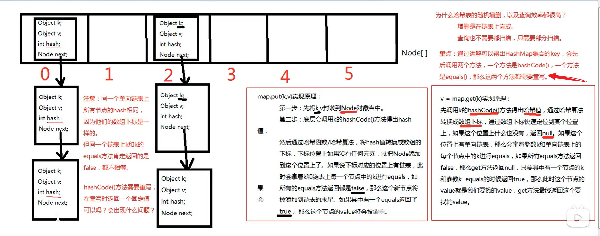

重点：放在HashMap集合key部分的元素，以及放在Hashset集合中的元素，需要同时重hashCode 利equals方法。
HashMap集合的默认初始化容量是16，默认加载团子是0.75这个默认加载因子是当HashMap集合合底层数组的容量达到75%的时候，数组开始扩容。
重点，记住：HashNap集合初始化容量必须是2的倍数，这也是宫方推荐的，这是因为达到散列均匀，为了提高HashMap集合的存取效率，所必须的。|

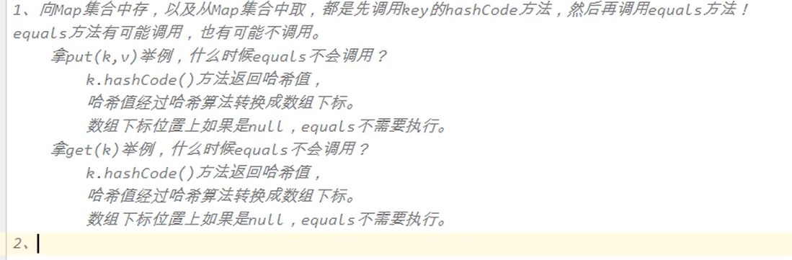

注意

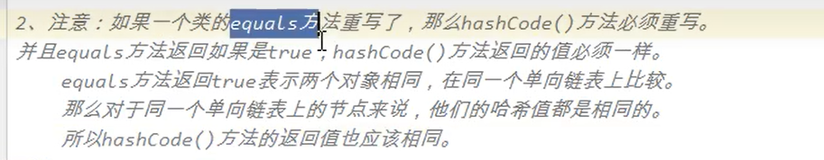

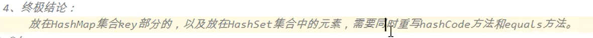

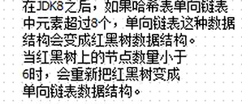

```java
package com.iteator.map;

import java.util.HashSet;
import java.util.Objects;
import java.util.Set;

//
public class HashMapTest01 {
    public static void main(String[] args) {
        Student s1 = new Student("zz");
        Student s2 = new Student("zz");
        System.out.println(s1.equals(s2));
        /*
        s1的hashcode = 1163157884
        s2的hashcode = 1956725890
         */
        System.out.println("s1的hashcode = " + s1.hashCode());
        System.out.println("s2的hashcode = " + s2.hashCode());
        /*
        s1.equals(s2)结果已经是true了，表示s1和s2是一样的，在hash中放的时候按说只能装一个
         */
        Set<Student> students = new HashSet<>();
        students.add(s1);
        students.add(s2);
        System.out.println(students.size());    //结果为2，正常为一，应该重写hashcode()
    }
}
class Student {
    private String name;

    public String getName() {
        return name;
    }

    public void setName(String name) {
        this.name = name;
    }

    public Student(String name) {
        this.name = name;
    }
    public Student() {
    }

    @Override
    public boolean equals(Object o) {
        if (this == o) return true;
        if (o == null || getClass() != o.getClass()) return false;
        Student student = (Student) o;
        return Objects.equals(name, student.name);
    }

    @Override
    public int hashCode() {
        return Objects.hash(name);
    }
}
```

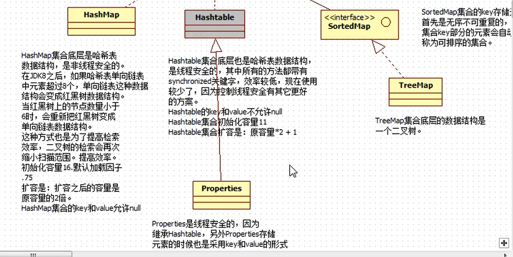

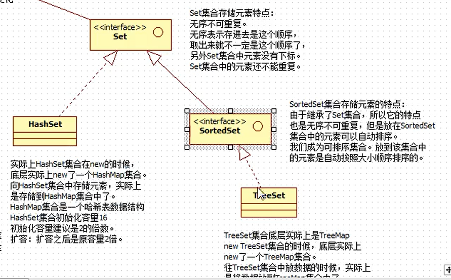

### Properties

```java
package com.iteator.map;

import java.util.Properties;

public class PropertiesTest {
    public static void main(String[] args) {
        Properties properties = new Properties();
        properties.setProperty("a","b");
        properties.setProperty("1","2");
        properties.setProperty("3","5");
        properties.setProperty("4","6");
        System.out.println(properties.getProperty("a"));
    }
}
```

### TreeSet

1.底层是treemap，treemap底层是一个二叉树

2.放到Treeset中的元素，等同于放到treemap集合中的key部分了

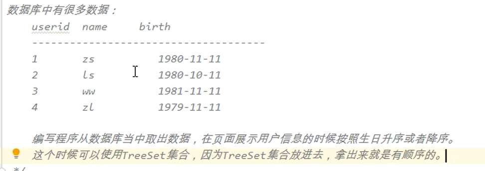

```java
package com.iteator.map;

import java.util.TreeSet;

public class TreeSetTest01 {
    public static void main(String[] args) {
        TreeSet<String> treeSet = new TreeSet<>();
        treeSet.add("b");
        treeSet.add("a");
        treeSet.add("c");
        treeSet.add("r");
        treeSet.add("d");
        for (String s : treeSet) {
            System.out.println(s);  //字符串排序

        }
        treeSet.clear();
        //不可以对自定义类型进行排序,没有实现comparable接口
        People people = new People(23);
        People people1 = new People(26);
        People people2 = new People(22);
        TreeSet<People> treeSet1 = new TreeSet<>();
        treeSet1.add(people);
        treeSet1.add(people1);
        treeSet1.add(people2);
        for (People s : treeSet1) {
            System.out.println(s);

        }
    }
}
class People implements Comparable<People>{
    int age;

    public People() {
    }

    public People(int age) {
        this.age = age;
    }

    @Override
    public String toString() {
        return "People{" +
                "age=" + age +
                '}';
    }

    @Override
    public int compareTo(People o) {
        return this.age - o.age;    //升序
    }
}
```

```java
package com.iteator.map;

import java.util.TreeSet;

public class TreeSetTest02 {
    public static void main(String[] args) {
        TreeSet<Vip> treeSet = new TreeSet<>();
        treeSet.add(new Vip("123",20));
        treeSet.add(new Vip("555",21));
        treeSet.add(new Vip("666",22));
        treeSet.add(new Vip("1111",22));
        treeSet.add(new Vip("11",19));
        for (Vip o : treeSet) {
            System.out.println(o);
        }
    }

}
class Vip implements Comparable<Vip>{
    String name;
    int age;

    public Vip(String name, int age) {
        this.name = name;
        this.age = age;
    }

    @Override
    public String toString() {
        return "Vip{" +
                "name='" + name + '\'' +
                ", age=" + age +
                '}';
    }

    public String getName() {
        return name;
    }

    public void setName(String name) {
        this.name = name;
    }

    public int getAge() {
        return age;
    }

    public void setAge(int age) {
        this.age = age;
    }

    @Override
    //排序规则
    public int compareTo(Vip o) {
        //年龄相等按名字排序
        if (this.age == o.age) {
            return this.name.compareTo(o.name);
        } else {
            //不一样按照年龄排
            return this.age - o.age;
        }
    }
}
```

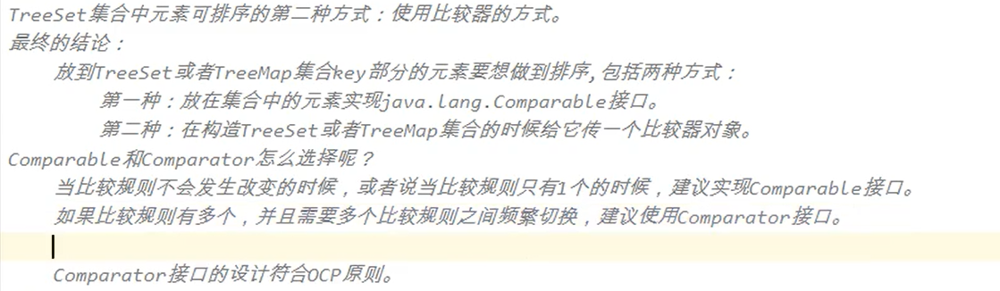


```java
package com.iteator.map;

import java.util.Comparator;
import java.util.TreeSet;

public class TreeSetTest01 {
    public static void main(String[] args) {
        TreeSet<String> treeSet = new TreeSet<>();
        treeSet.add("b");
        treeSet.add("a");
        treeSet.add("c");
        treeSet.add("r");
        treeSet.add("d");
        for (String s : treeSet) {
            System.out.println(s);  //字符串排序

        }
        treeSet.clear();
        //不可以对自定义类型进行排序,没有实现comparable接口
        People people = new People(23);
        People people1 = new People(26);
        People people2 = new People(22);
        //TreeSet<People> treeSet1 = new TreeSet<>(new PeopleComparable());
        //匿名内部类
        TreeSet<People> treeSet1 = new TreeSet<>(new Comparator<People>() {
            @Override
            public int compare(People o1, People o2) {
                return o1.age - o2.age;
            }
        });
        treeSet1.add(people);
        treeSet1.add(people1);
        treeSet1.add(people2);
        for (People s : treeSet1) {
            System.out.println(s);

        }
    }
}
class People {
    int age;

    public People() {
    }

    public People(int age) {
        this.age = age;
    }

    @Override
    public String toString() {
        return "People{" +
                "age=" + age +
                '}';
    }
}
//单独编写一个比较器
//comparable是java.util.lang下的，comparator是java.util包下的
/*class PeopleComparable implements Comparator<People> {

    @Override
    public int compare(People o1, People o2) {
        return o1.age - o2.age;
    }
}*/
```

## 12 IO流

### 四大家族

java Io流这块有四大家族(他们都是抽象类)：
java.io.Inputstream字节输入流
java.io.outputstream 字节输出流

java.io.Reader字符输入流
java.io.Writer字符输出流
注意：在java中只要类名以stream结尾的都是字节流。以Reader/writer结尾的都是字符流

所有的流都实现了：java.io.Closeable接口，都是可关闭的，都有close（）方法。流毕竟是一个管道，这个是内存和硬盘之间的通道，用完之后一定要关闭，不然会耗费（占用）很多资源。养成好习惯，用完流一定要关闭。|

所有的输出流都实现了：
java.io.Flushable接口，都是可刷新的，都有flush（）方法。
养成一个好习惯，输出流在最终输出之后，一定要记得flush（）刷新一下。这个刷新表示将通道/管道当中剩余未输出的数据强行输出完（清空管道！）刷新的作用就是清空管道。注意：如果没有flush（）可能会导致丢失数据。|

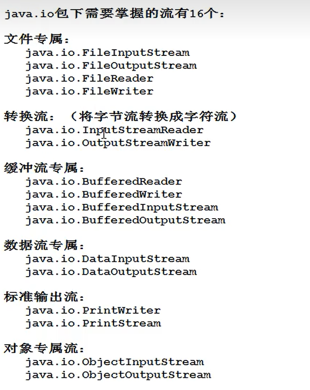

### FileInputStream

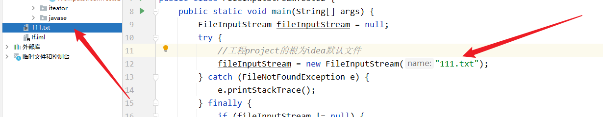

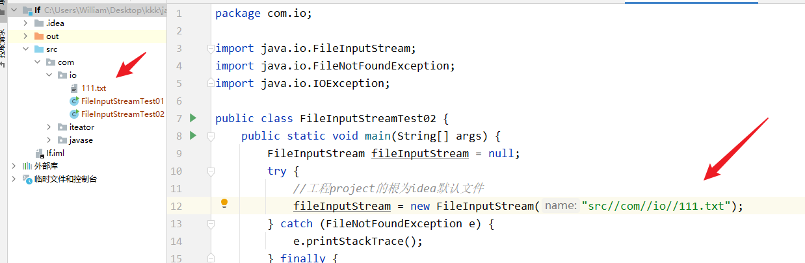

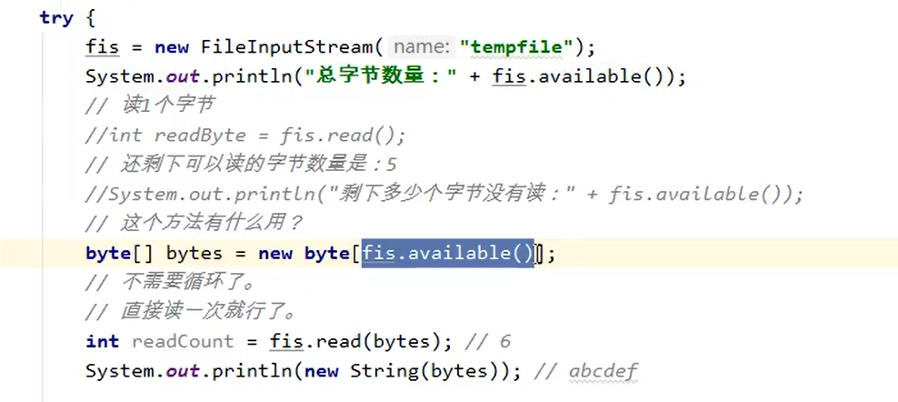

```java
package com.io;

import java.io.FileInputStream;
import java.io.FileNotFoundException;
import java.io.IOException;

public class FileInputStreamTest02 {
    public static void main(String[] args) {
        FileInputStream fileInputStream = null;
        try {
            //工程project的根为idea默认文件
            fileInputStream = new FileInputStream("src//com//io//111.txt");
            byte b[] = new byte[4]; //一次读取四个字节
            /*int readCount = fileInputStream.read(b);    //返回四,再调方法时4个数组满了，重新来覆盖
            System.out.println(new String(b,0,readCount));  //读到多少就打印多少
            readCount = fileInputStream.read(b);
            System.out.println(new String(b,0,readCount));
            readCount = fileInputStream.read(b);
            System.out.println(new String(b,0,readCount));*/
            /*while(true) {
                int readCount = fileInputStream.read(b);
                if (readCount == -1) {
                    break;
                }
                System.out.println(new String(b,0,readCount));
            }*/
            int readCount = 0;
            while ((readCount = fileInputStream.read(b)) != -1) {
                System.out.println(new String(b,0,readCount));
            }
        } catch (FileNotFoundException e) {
            e.printStackTrace();
        } catch (IOException e) {
            e.printStackTrace();
        } finally {
            if (fileInputStream != null) {
                try {
                    fileInputStream.close();
                } catch (IOException e) {
                    e.printStackTrace();
                }
            }
        }
    }
}
```

### FileOutputStream

```java
package com.io;

import java.io.FileNotFoundException;
import java.io.FileOutputStream;
import java.io.IOException;
import java.nio.charset.StandardCharsets;

public class FileOutPutStreamTest01 {
    public static void main(String[] args) {
        FileOutputStream fileOutputStream = null;
        try {
            //源文件清空重新写入/新建
            //fileOutputStream = new FileOutputStream("111.txt");
            //追加
            fileOutputStream = new FileOutputStream("src//com//io//111.txt",true);
            byte[] bytes = {97,98,99,100};
            fileOutputStream.write(bytes);
            fileOutputStream.write(bytes,0,4);
            String s = "活塞环股份尼斯不和你";
            byte[] bytes1 = s.getBytes(StandardCharsets.UTF_8);
            fileOutputStream.write(bytes1);
            fileOutputStream.flush();   //写完一定要刷新
        } catch (FileNotFoundException e) {
            e.printStackTrace();
        } catch (IOException e) {
            e.printStackTrace();
        } finally {
            try {
                fileOutputStream.close();
            } catch (IOException e) {
                e.printStackTrace();
            }
        }
    }
}
```

### BufferReader

```java
package com.io;

import java.io.BufferedReader;
import java.io.FileNotFoundException;
import java.io.FileReader;
import java.io.IOException;

public class BufferReaderTest01 {
    public static void main(String[] args) {
        FileReader fileReader = null;
        BufferedReader br = null;
        try {
            fileReader = new FileReader("src//com//io//111.txt");
            br =new BufferedReader(fileReader);
           // System.out.println(br.readLine());
            //读取一行,不带换行符
            String s = null;
            while ((s = br.readLine()) != null) {
                System.out.println(s);
            }
        } catch (FileNotFoundException e) {
            e.printStackTrace();
        } catch (IOException e) {
            e.printStackTrace();
        } finally {
            if (br != null) {
                try {
                    br.close();
                } catch (IOException e) {
                    e.printStackTrace();
                }
            }
        }
    }
}
```

### BufferedWriter

```java
package com.io;

import java.io.*;

public class BufferdWriteTest01 {
    public static void main(String[] args) {
        BufferedWriter bufferedWriter = null;
        try {
            bufferedWriter = new BufferedWriter(new OutputStreamWriter(new FileOutputStream("src//com//io//111.txt",true)));
            bufferedWriter.write("nbswigisdigbn");
            bufferedWriter.flush();
        } catch (IOException e) {
            e.printStackTrace();
        } finally {
            if (bufferedWriter != null) {
                try {
                    bufferedWriter.close();
                } catch (IOException e) {
                    e.printStackTrace();
                }
            }
        }
    }
}
```

### File

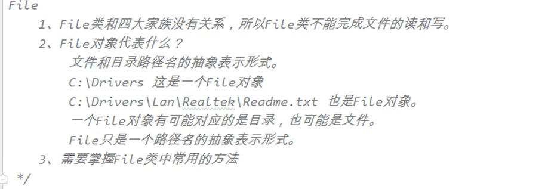

https://blog.csdn.net/weixin_52533007/article/details/123274351


目录拷贝

### 文件路径

文件在src类文件目录下才可以使用

根路径默认在src

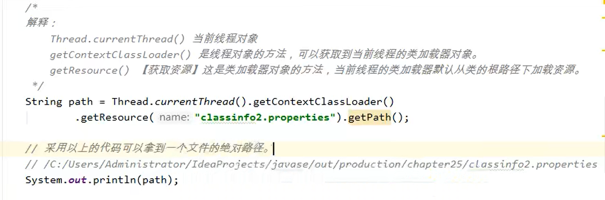

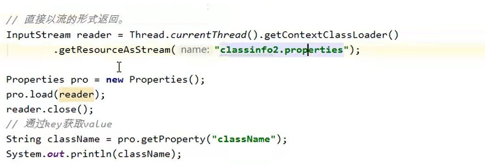

### 资源绑定器

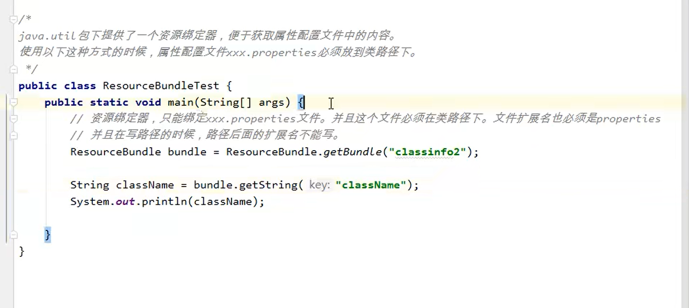

### 序列化

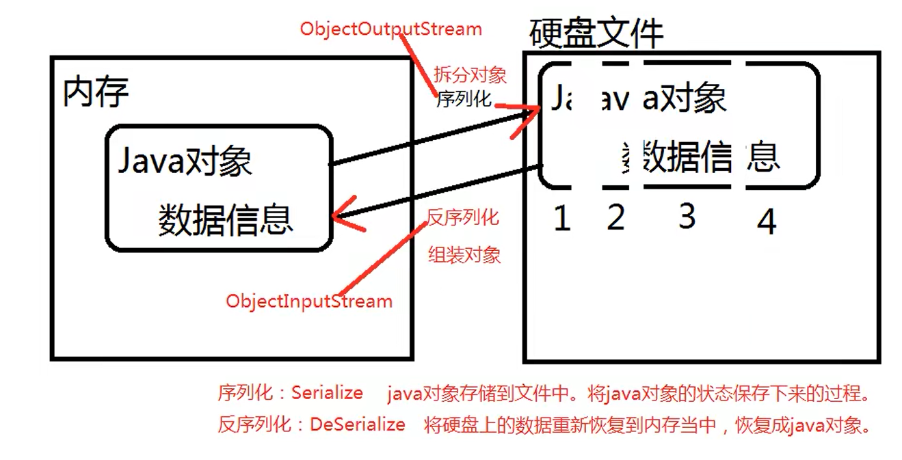

参与序列化与反序列化的

对象必须实现`Serializable`接口,接口什么也没有，jvm会默认提供一个序列化版本号

`transient`表示游离的，不参与序列化

### IO和Properties联合使用

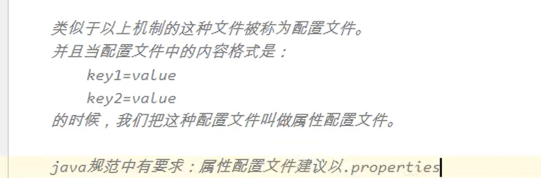

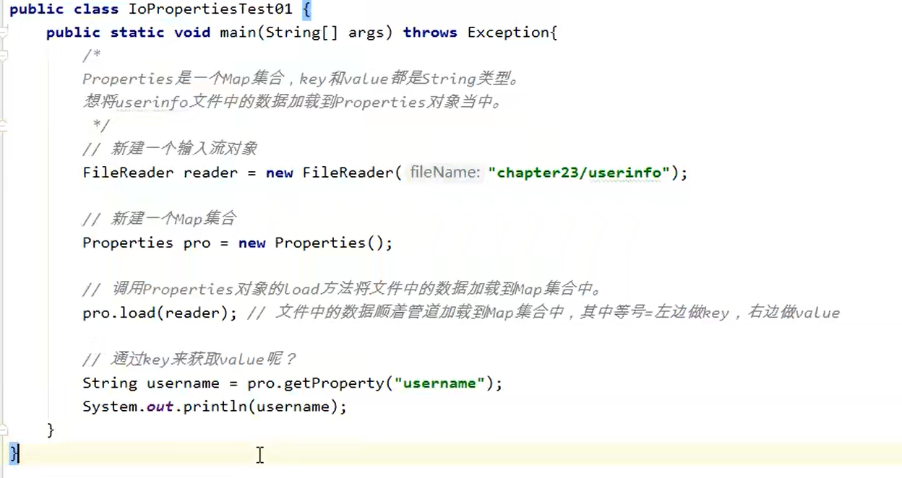

### 多线程

#### 实现

第二种采用多

```java
package com.thread;
//实现线程第一种方法
/*
编写一个类，直接继承java.lang.thread，重写run方法
 */
public class ThreadTest01 {
    public static void main(String[] args) {
        MyThread myThread = new MyThread();
        myThread.start();   //在jvm开辟一个新的栈空间，代码任务瞬间就结束了。自动调用run方法
        for (int i = 0; i < 1000; i++) {
            System.out.println("主线程--->"+i);
        }
    }
}
class MyThread extends Thread {
    @Override
    public void run() {
        for (int i = 0; i < 1000; i++) {
            System.out.println("分支线程--->"+i);
        }
    }
}
```


```java
package com.thread;

public class ThreadTest02 {
    //第二种方式，编写一个类，实现java.lang.Runnable，实现run方法
    public static void main(String[] args) {
        MyRunnable myRunnable = new MyRunnable();
        Thread t = new Thread(new MyRunnable());
        t.start();
        for (int i = 0; i < 1000; i++) {
            System.out.println("专线线程--->"+i);
        }
    }
}
class MyRunnable implements Runnable {

    @Override
    public void run() {
        for (int i = 0; i < 1000; i++) {
            System.out.println("分支线程--->"+i);
        }
    }
}
```

#### 线程生命周期

#### 线程名字

setName()

getName()

当线程没有命名，默认Thread-0，Thread-1，Thread-1....

#### 获取当前线程

``static Thread`currentThread()`  返回对当前正在执行的线程对象的引用。 

#### 线程Sleep方法

Thread.sleep(毫秒)

面试

不会

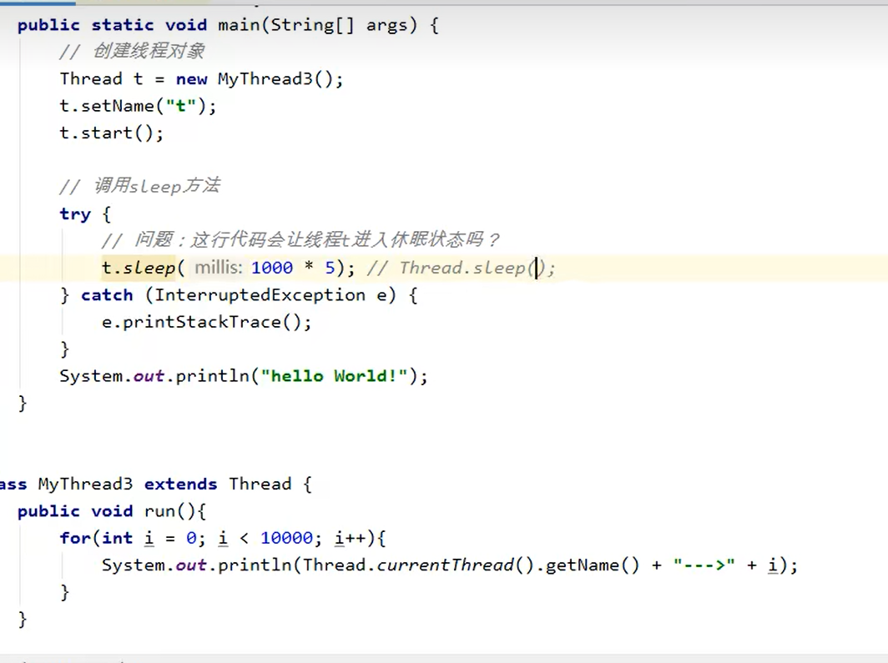

#### 终止线程的睡眠

t.interrupt();	//靠异常处理机制，报异常结束try catch

终止一个线程的执行

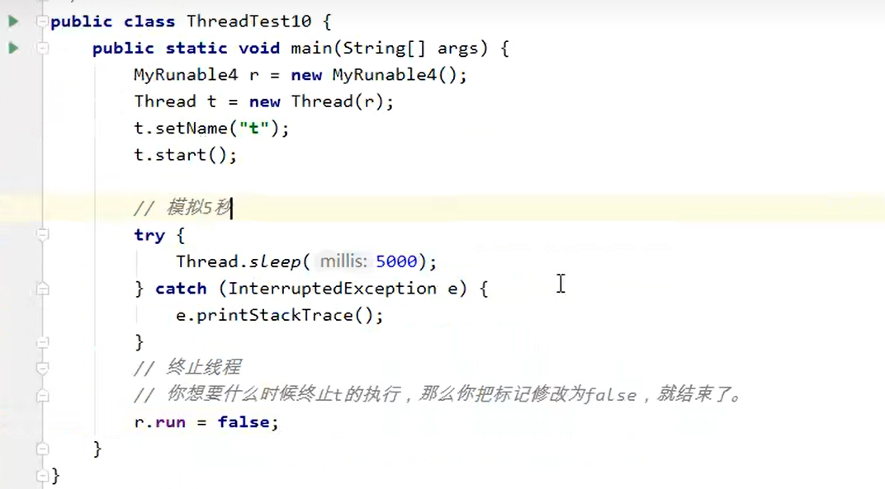

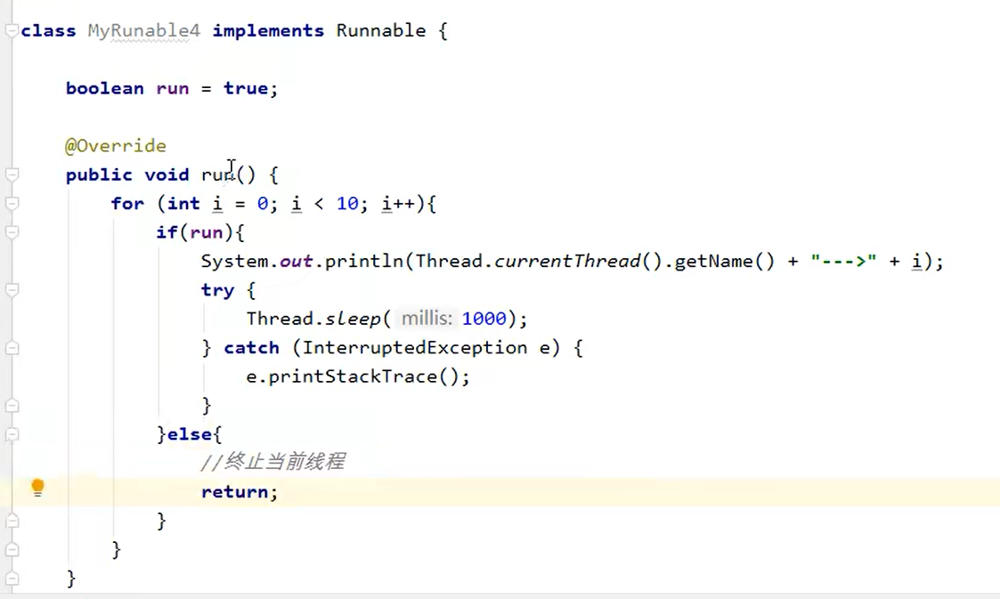

#### 线程优先级

#### 线程合并

#### *线程的安全*（重点）

什么时候数据在多线程并发的环境下会存在安全问题呢?
三个条件:
条件1:多线程并发。
条件2:有共享数据。
条件3:共享数据有修改的行为。
满足以上3个条件之后，就会存在线程安全问题。

怎么解决线程安全问题呀?
使用"线程同步机制”。

异步编程模型:
线程t1和线程t2，各自执行各自的，t1不管t2，t2不管t1，谁也不需要等谁,这种编程模型叫做:异步编程模型。其实就是:多线程并发(率较高。)
同步编程模型:
线程t1和线程t2，在线程t1执行的时候，必须等待t2线程执行结束，或者说在t2线程执行的时候，必须等待t1线程执行结束，两个线程之间发生了等待关系,这就是同步编程模型。效率较低。线程排队执行。

有问题哦

```java
package com.thread;

public class ThreadTest03 {
    public static void main(String[] args) {
        Account account = new Account("001",10000);
        Thread thread = new AccountThread(account);
        Thread thread1 = new AccountThread(account);
        thread.setName("t1");
        thread1.setName("t2");
        thread.start();
        thread1.start();

    }
}
class Account {
    private String number;//账号
    private double balance;
    public Account() {

    }

    public Account(String number, double balance) {
        this.number = number;
        this.balance = balance;
    }

    public String getNumber() {
        return number;
    }

    public void setNumber(String number) {
        this.number = number;
    }

    public double getBalance() {
        return balance;
    }

    public void setBalance(double balance) {
        this.balance = balance;
    }
    //取款
    public void withDraw(double money) {
        try {
            Thread.sleep(1000);
        } catch (InterruptedException e) {
            e.printStackTrace();
        }
        balance -= money;
    }
}
class AccountThread extends Thread {
    private Account act;

    public AccountThread(Account act) {
        this.act = act;
    }

    @Override
    public void run() {
        ///思考:t1执行到这里了，但还没有来得及执行这行代码，t2线程进来withdraw方法了。此时一定出问题。
        String s = Thread.currentThread().getName();
        System.out.println(s + "将要执行，账户"+act.getNumber()+"当前余额"+act.getBalance());
        act.withDraw(1000.0);

        System.out.println(s + "线程执行了，"+"账户"+act.getNumber()+"取款"+ 1000+"成功，余额" +act.getBalance());
    }
}
```

#### synchronized实现线程同步

```java
package com.thread;

public class ThreadTest03 {
    public static void main(String[] args) {
        Account account = new Account("001",10000);
        Thread thread = new AccountThread(account);
        Thread thread1 = new AccountThread(account);
        thread.setName("t1");
        thread1.setName("t2");
        thread.start();
        thread1.start();

    }
}
class Account {
    private String number;//账号
    private double balance;
    public Account() {

    }

    public Account(String number, double balance) {
        this.number = number;
        this.balance = balance;
    }

    public String getNumber() {
        return number;
    }

    public void setNumber(String number) {
        this.number = number;
    }

    public double getBalance() {
        return balance;
    }

    public void setBalance(double balance) {
        this.balance = balance;
    }
    //取款
    public void withDraw(double money) {
        //小括号写你希望哪些线程同步，共享数据的对象
        synchronized (this) {
            balance -= money;
        }
    }
}
class AccountThread extends Thread {
    private Account act;

    public AccountThread(Account act) {
        this.act = act;
    }

    @Override
    public void run() {
        ///思考:t1执行到这里了，但还没有来得及执行这行代码，t2线程进来withdraw方法了。此时一定出问题。
        String s = Thread.currentThread().getName();
        System.out.println(s + "将要执行，账户"+act.getNumber()+"当前余额"+act.getBalance());
        act.withDraw(1000.0);

        System.out.println(s + "线程执行了，"+"账户"+act.getNumber()+"取款"+ 1000+"成功，余额" +act.getBalance());
    }
}
```

synchronized有三种写法:
第一种:同步代码块灵活
synchronized(线程共享对象){
同步代码块;
}
第二种:在实例方法上使用synchronized
表示共享对象一定是this
并且同步代码块是整个方法体。
第三种:在静态方法上使用synchronized
表示找类锁。
类锁永远只有1把。
就算创建了100个对象,那类锁也只有一把。对象锁:1个对象1把锁,100个对象100把锁。类锁:100个对象,也只是1把类锁。

#### 死锁

```java
package com.thread;

public class ThreadTest04 {
    public static void main(String[] args) {
        Object o1 = new Object();
        Object o2 = new Object();
        MyThread1 myThread1 = new MyThread1(o1,o2);
        MyThread1 myThread2 = new MyThread1(o1,o2);
    }
}
class MyThread1 extends Thread {
    Object object1;
    Object object2;

    public MyThread1(Object object1, Object object2) {
        this.object1 = object1;
        this.object2 = object2;
    }

    @Override
    public void run() {
        //sisuo
        synchronized (object1) {
            synchronized (object2) {

            }
        }
    }
}
class MyThread2 extends Thread {
    Object object1;
    Object object2;

    public MyThread2(Object object1, Object object2) {
        this.object1 = object1;
        this.object2 = object2;
    }

    @Override
    public void run() {
        synchronized (object2) {
            synchronized (object1) {

            }
        }
    }
}
```

聊一聊，我们以后开发中应该怎么解决线程安全问题?是一上来就选择线程同步吗?synchronized
不是，synchronized会让程序的执行效率降低,用户体验不好。系统的用户吞吐量降低。用户体验差。在不得已的情况下再选择线程同步机制。
第一种方案:尽量使用局部变量代替实例变量和静态变量。
第二种方案:如果必须是实例变量，那么可以考虑创建多个对象，这样
实例变量的内存就不共享了。(一个线程对应1个对象，100个线程对应100个对象，对象不共享，就没有数据安全问题了。)
第三种方案:如果不能使用局部变量，对象也不能创建多个，这个时候就只能选择synchronized 了。线程同步机制。

#### 守护线程


java语言中线程分为两大类:
一类是:用户线程
一类是:守护线程(后台线程)
其中具有代表性的就是:垃圾回收线程（守护线程)。守护线程的特点:
一般守护线程是一个死循环，所有的用户线程只要结束，守护线程自动结束。
注意:主线程main方法是一个用户线程。守护线程用在什么地方呢?
每天00 :o0的时候系统数据自动备份。
这个需要使用到定时器，并且我们可以将定时器设置为守护线程。一直在那里看着p没到00:00的时候就备份一次。所有的用户线程如果结束了，守护线程自动退出，没有必要进行数据备份了。

```java
package com.thread;

public class ThreadTest05 {
    public static void main(String[] args) {
        Th th = new Th();
        th.setName("后台线程");
        th.setDaemon(true); //设置后台线程
        th.start();
        for (int i = 0; i < 10; i++) {
            System.out.println(Thread.currentThread().getName() + "主线程进行");
            try {
                Thread.sleep(1000);
            } catch (InterruptedException e) {
                e.printStackTrace();
            }
        }
    }
}
class Th extends Thread{
    @Override
    public void run() {
        while (true) {
            System.out.println(currentThread().getName() + "备份");
        }
    }
}
```

#### 定时器

定时器
定时器的作用:
间隔特定的时间，执行特定的程序。
每周要进行银行账户的总账操作。每天要进行数据的备份操作。
在实际的开发中，每隔多久执行一段特定的程序，这种需求是很常见的，那么在java中其实可以采用多种方式实现:
可以使用sleep方法，睡眠，设置睡眠时间，没到这个时间点醒来，执行任务。这种方式是最原始的定时器。(比较low)
在java的类库中已经写好了一个定时器:javautil.Timer，可以直接拿来用。不过，这种方式在目前的开发中也很少用因为现在有很多高级框架都是支持定时任务的。在实际的开发中，目前使用较多的是Spring框架中提供的springTask框架，这个框架只要进行简单的配置，就可以完成定时器的任务。

```java
package com.thread;

import java.sql.Time;
import java.text.ParseException;
import java.text.SimpleDateFormat;
import java.util.Date;
import java.util.Timer;
import java.util.TimerTask;

public class TimeTest {
    public static void main(String[] args) {
        Timer timer = new Timer();
        SimpleDateFormat simpleDateFormat = new SimpleDateFormat("yyyy-MM-dd HH:mm:ss");
        try {
            Date firstTime = simpleDateFormat.parse("2022-03-14 09:30:33");
            timer.schedule(new LogTimeTask(),firstTime,1000*10);
        } catch (ParseException e) {
            e.printStackTrace();
        }

    }
}
//定时任务类
class LogTimeTask extends TimerTask {
    @Override
    public void run() {
        SimpleDateFormat simpleDateFormat = new SimpleDateFormat("yyyy-MM-dd HH:mm:ss");
        String strTime = simpleDateFormat.format(new Date());
        System.out.println(strTime + "成功完成了一次数据备份");
    }
}
```

#### 实现线程的第三种方式 callable

#### wait notify


第一: wait和notify方法不是线程对象的方法，是java中任何一个java对象都有的方法，因为这两个方式是object类中自带的。
wait方法和notify方法不是通过线程对象调用，
不是这样的: t.wait()，也不是这样的: t.notify() ..不对。

第二: wait()方法作用?
object o = new Object() ;o.wait() ;
表示:
让正在o对象上活动的线程进入等待状态，无期限等待，直到被唤醒为止。
o.wait();方法的调用,会让"当前线程（正在o对象上活动的线程)"进入等待状态。
第三: notify()方法作用?
object o = new Object() ;o . notify() ;
表示:
唤醒正在o对象上等待的线程。还有一个notifyAl1()方法:
这个方法是唤醒o对象上处于等待的所有线程。

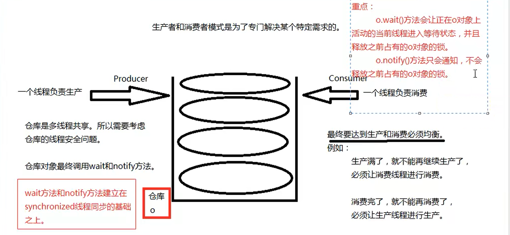

### 文件的路径

- getresource此处从classpathes路径加载

```java
package org.example;

import java.io.FileNotFoundException;
import java.io.FileReader;

public class Main {
    public static void main(String[] args) {
        try {
            //idea默认当前路径是project跟，代码移植这个路径就无效了
            FileReader fileReader = new FileReader("aboutPath/pom.xml");
            //通用的，文件必须放在类路径下，凡是src路径下都是类路径，src是类的根路径
            /*
              Thread.currentThread()当前线程对象
              getContextCLassLoader()是线程对象的方法，可以获取到当前线程的类加载器对象。
              getResource()这是类加载器对象的方法，当前线程的类加载器默认从类的根路径下加载资源。
              获取一个文件的绝对路径
             */
            String path = Thread.currentThread().getContextClassLoader().getResource("ll.xml").getPath();
            System.out.println(path);
        } catch (FileNotFoundException e) {
            throw new RuntimeException(e);
        }
    }
}
```


### 反射机制

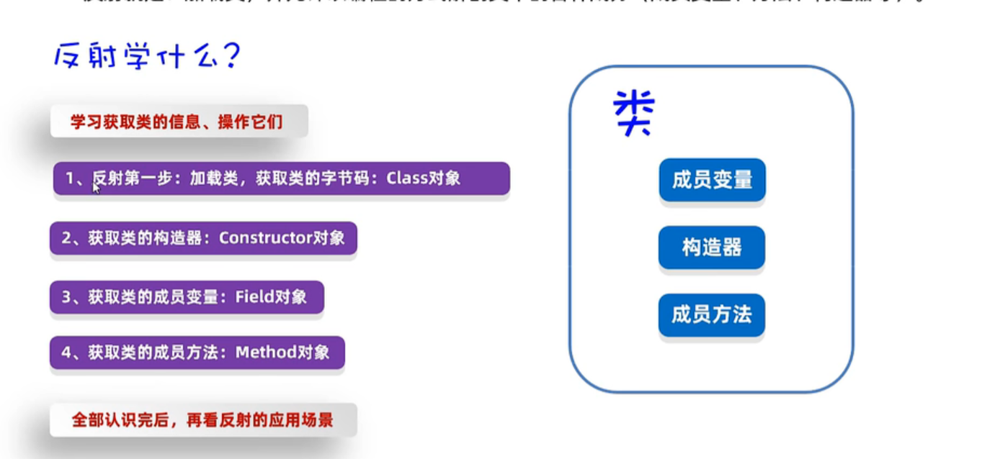

反射机制有什么用?
通过java语言中的反射机制可以操作字节码文件。优点类似于黑客。(可以读和修改字节码文件。>通过反射机制可以操作代码片段。(class文件。)
反射机制的相关类在哪个包下?
java . lang . reflect.* ;
反射机制相关的重要的类有哪些?
java. lang.class:代表整个字节码,代表一个类型
java.lang.reflect.Method:代表字节码中的方法字节码。
java.lang.reflect.Constructor:代表字节码中的构造方法字节码。java.lang.reflect.Field:代表字节码中的属性字节码。

#### 1 获取class的三种方式

##### 一、Class.forName()

1、静态方法
2．方法的参数是一个字符串。字符串需要的是一个完整类名。
3、完整类名必须带有包名。java .iang包也不能省略。

```java
Class<?> c2 = Class.forName("org.example.Student"); //class<?>表示接收的类对象可以是任意类型的与之相对应的比如class<String>就只能接收String的类对象 以此类推
```

##### 二、getClass()

java中任何一个对象都有一个方法: getClass()

String s = "abc" ;
class x = s.getclass(); // x代表string.class字节码文件，x代表string类型。System.out.println(c1 == x); // true ( ==判断的是对象的内存地址。)

```java
Student student = new Student();
Class<? extends Student> c3 = student.getClass();
```


##### 三、java语言中任何一种类型，包括基本数据类型，它都有.class属性。

Class z = String.class; i l z代表string类型
Class k = Date.class; l l/ k代表Date类型
class f = int.c1ass; l/于代表int类型
Class e = double.class; l / e代表double类型

```java
Class<Student> c1 = Student.class;
System.out.println(c1.getName());	//全类名
```

#### 2 获取类的构造器

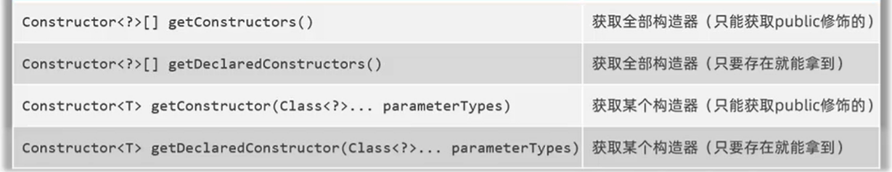

##### 通过反射实例化对象

```java
@Test
public void testGetConstructor() {
    try {
        Class<?> c = Class.forName("org.example.Student");
        //获取无参构造方法
        Constructor<?> constructor = c.getDeclaredConstructor();
        System.out.println(constructor.getName()+"--"+constructor.getParameterCount());
        Student student = (Student)constructor.newInstance();
        System.out.println(student);

        Constructor<?> constructor1 = c.getDeclaredConstructor(String.class,String.class);
        System.out.println(constructor1.getName()+"--"+constructor1.getParameterCount());
        Student student1 = (Student)constructor1.newInstance("李华","132114");
        System.out.println(student1);
    } catch (ClassNotFoundException | NoSuchMethodException | InstantiationException | IllegalAccessException |
             InvocationTargetException e) {
        throw new RuntimeException(e);
    }
}
```

##### 只让静态代码块执行，使用forname

如果你只是希望一个类的静态代码块执行，其它代码一律不执行，你可以使用:
Class.forName( "完整类名");
这个方法的执行会导致类加载，类加载时，静态代码块执行。

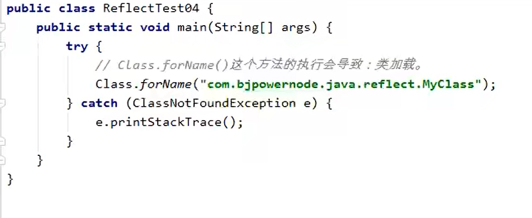

#### 3 获取field（重点）

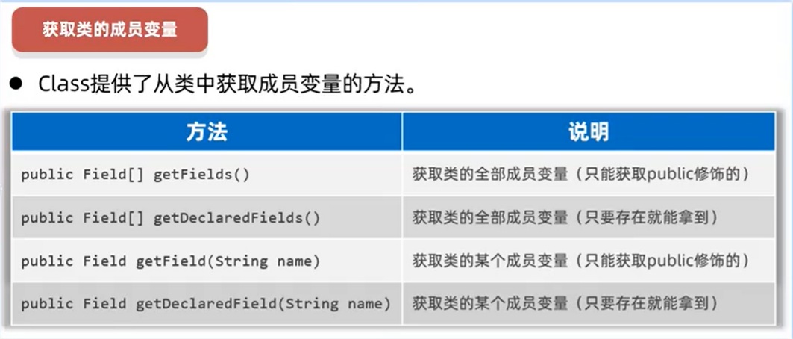

```java
public void testField() {
        try {
            Class<?> c = Class.forName("org.example.Student");
            //获取类中的全部成员变量
            Field[] declaredFields = c.getDeclaredFields();
            for (Field field:declaredFields) {
                System.out.println(field.getName()+"--"+field.getType());
            }
            ////获取类中的某一个成员变量
            Field declaredField = c.getDeclaredField("name");
            System.out.println(declaredField.getName()+"--"+declaredField.getType());
             //赋值
            declaredField.setAccessible(true);
            Student student = new Student();
            declaredField.set(student,"康康");
            System.out.println(student);
            //取值
            String name = (String) declaredField.get(student);
            System.out.println(name);
        } catch (ClassNotFoundException | NoSuchFieldException | IllegalAccessException e) {
            throw new RuntimeException(e);
        }
    }
```

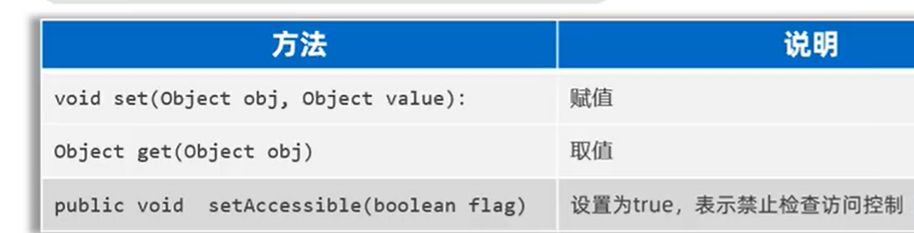

#### 4 Method（重点）

##### 可变长参数

```java
package com.reflect;

public class ArgTest {
    public static void main(String[] args) {
    //参数个数为0·n个，只能在参数列表最后出现，并且只能有一个
        m();
        m(1,2,3);
        m(1);
        s(new String[] {"1","2"});
        s("1","2");
    }
    public static void m(int... a) {

    }
    public static void s(String... s) {
    
    }

}
```


```java
 @Test
public void testMethod() {
    try {
        Class<?> c = Class.forName("org.example.Student");
        //获取类的全部成员方法
        Method[] declaredMethods = c.getDeclaredMethods();
        for (Method method:declaredMethods) {
            System.out.println(method.getName()+"--->"+method.getParameterCount()+"--->"+method.getReturnType());
        }
        //获取某个成员方法
        Method getName = c.getDeclaredMethod("getName");
        System.out.println(getName.getName()+"--->"+getName.getParameterCount()+"--->"+getName.getReturnType());

        Method setName = c.getDeclaredMethod("setName", String.class);
        System.out.println(setName.getName()+"--->"+setName.getParameterCount()+"--->"+setName.getReturnType());
        //方法执行
        Student student = new Student();
        Object xxx = setName.invoke(student, "xxx");
        System.out.println("1."+xxx);
        Object rs = getName.invoke(student);    //无参
        System.out.println("2."+rs);
    } catch (ClassNotFoundException | NoSuchMethodException | IllegalAccessException | InvocationTargetException e) {
        throw new RuntimeException(e);
    }
}
```

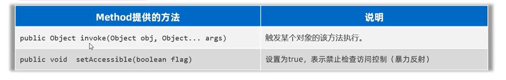

##### 获取父类和父类接口

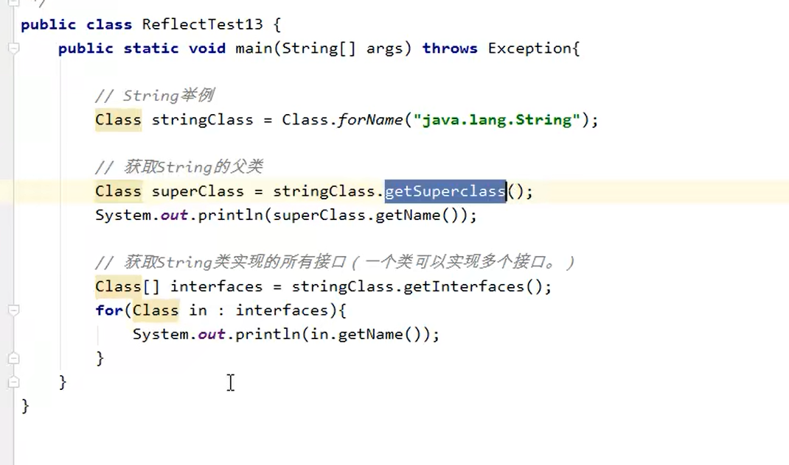

### 注解

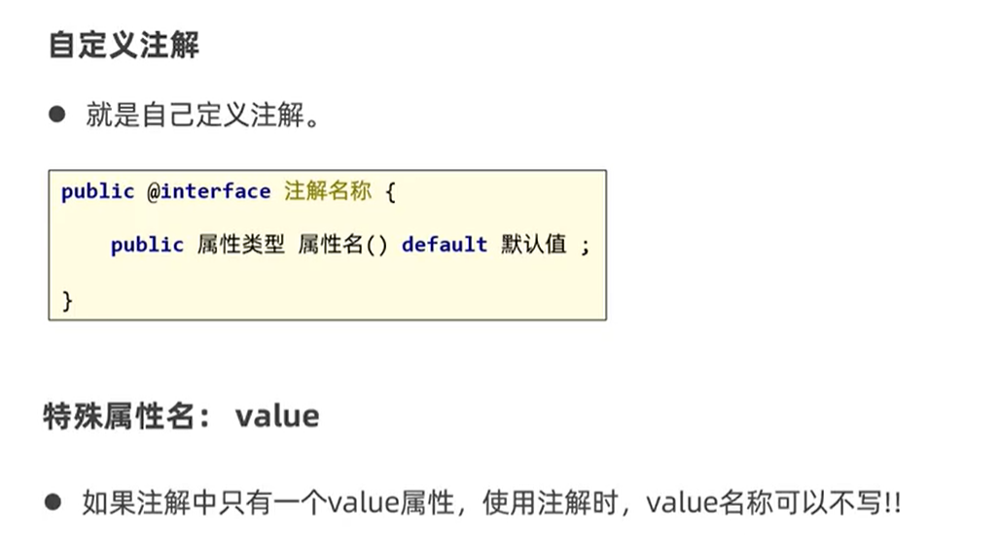

```java
@Deprecated	//过时
@Override//重写了父类
```

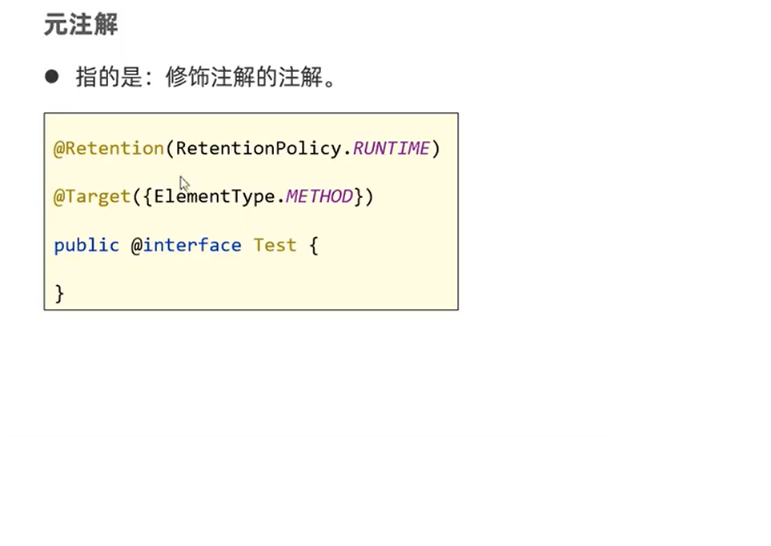

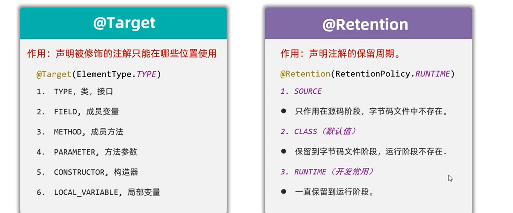

#### 解析注解

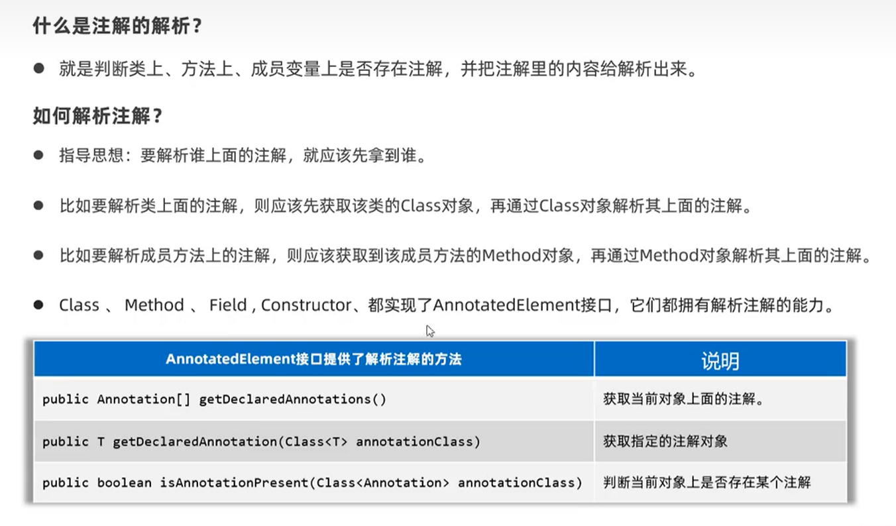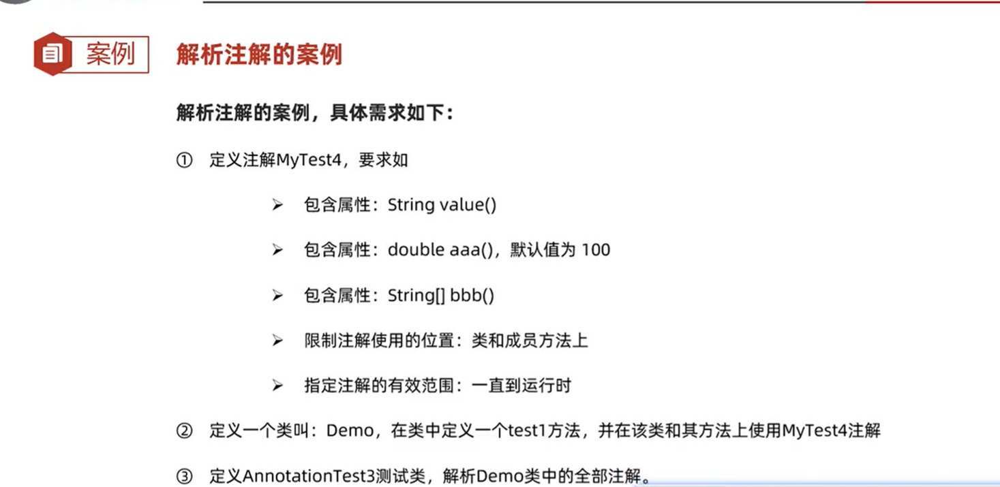

```java
@Test
public void parseClass() {
    try {
        //获得class对象
        Class<?> aClass = Class.*forName*("org.example.Demo");
        //解析注解
        //判断类上面是否有注解
        if (aClass.isAnnotationPresent(MyTest4.class)) {
            MyTest4 myTest4 = aClass.getDeclaredAnnotation(MyTest4.class);
            System.*out*.println(myTest4.value());
            System.*out*.println(myTest4.aaa());
            System.*out*.println(Arrays.*toString*(myTest4.bbb()));
        }
    } catch (ClassNotFoundException e) {
        throw new RuntimeException(e);
    }
}
```

